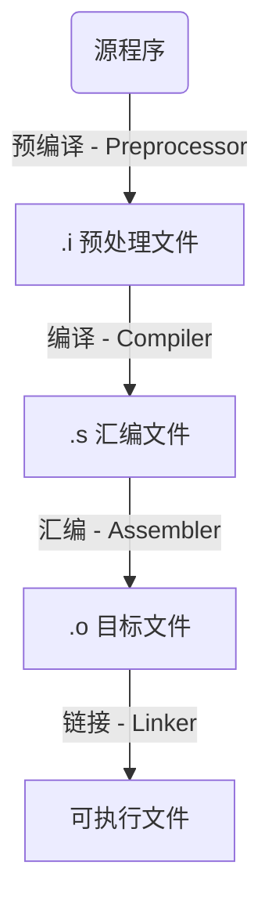

---
Title | Programing Compiler
-- | --
Created @ | `2021-06-01T07:22:07Z`
Updated @| `2023-09-11T03:38:42Z`
Labels | ``
Edit @| [here](https://github.com/junxnone/xwiki/issues/12)

---
# 编译器

- Compiler - 编译器 - `将编程语言解释为处理器可执行指令`

Name | Description | OS 
-- | -- | --
[GCC](/GCC) | GNU Compiler Collection - 开源软件常用的编译器 | Linux
MSVC | 微软开发的编译器 | Windows
[ICC](/Intel_Compiler) | Intel C++ Compiler Hardware 优化 | Linux/Windows
Clang | LLVM - Low Level Virtual Machine 编译器  | OS X
BCC | Borland C++ 退出历史？？？

- **LLVM Project** is a collection of modular and reusable compiler and toolchain technologies

## Steps

Name | Inputs | Outputs | GCC | ICC
-- | -- | -- | -- | -- 
预处理器(Preprocessor) | 源代码 | 预处理的代码
编译器(Compiler) | ↑ | 汇编代码 | gcc/g++ | icl/icx/icc/icpc/icpx
汇编器(Assembler) | ↑ | 可重定位的机器代码 | as |
链接器(Linker) | 库文件 + ↑ | 目标机器代码
加载器(Loader) | 库文件 

## Tools 

Name | Description
-- | --
AR | 库管理器
OBJDUMP |
RANLIB |

## Reference
- [GCC](https://gcc.gnu.org/)
- [LLVM](https://llvm.org/)
- [ICC](https://software.intel.com/content/www/us/en/develop/documentation/cpp-compiler-developer-guide-and-reference/top.html)
- [Compiler Explorer](https://godbolt.org/)

