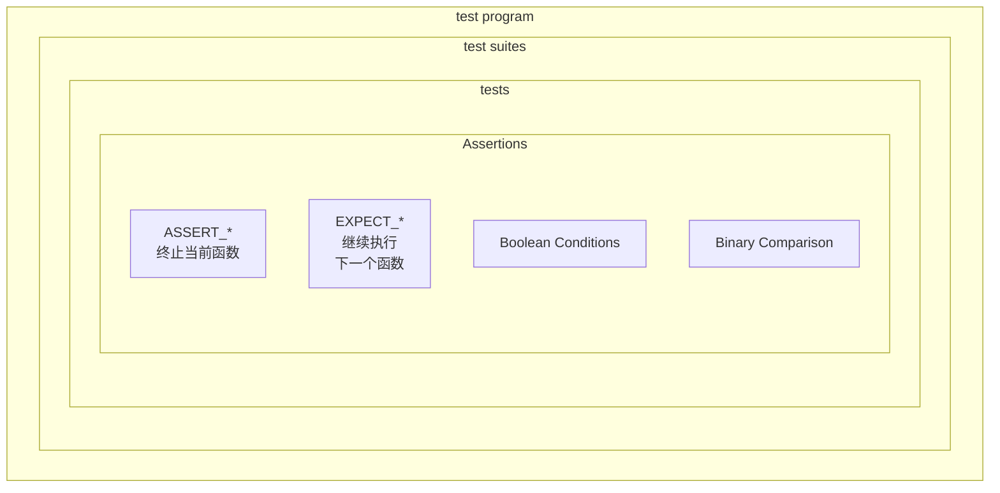

---
Title | Programing test googletest
-- | --
Created @ | `2023-03-26T15:46:53Z`
Updated @| `2023-03-26T15:46:53Z`
Labels | ``
Edit @| [here](https://github.com/junxnone/xwiki/issues/232)

---
# googletest
- googletest - `gtest`
- goolgemock - `gmock`
- 跨平台: Linux/Windows/MacOS
- C++


## Arch



## Assertions
- `ASSERT_*`
- `EXPECT_*`
- **boolean Conditions**
  - `EXPECT_TRUE(condition)` : condition 是 true
  - `EXPECT_FALSE(condition)` : condition 是 false
  - `ASSERT_TRUE(condition)`
  - `ASSERT_FALSE(condition)`
- **Binary Comparison**
  - `EXPECT_EQ(val1, val2)` : val1 == val2
  - `EXPECT_NE(val1, val2)` : val1 != val2
  - `EXPECT_LT(val1, val2)` : val1 < val2
  - `EXPECT_LE(val1, val2)` : val1 <= val2
  - `EXPECT_GT(val1, val2)` : val1 > val2
  - `EXPECT_GE(val1, val2)` : val1 >= val2
  - `ASSERT_EQ(val1, val2)`
  - `ASSERT_NE(val1, val2)`
  - `ASSERT_LT(val1, val2)`
  - `ASSERT_LE(val1, val2)`
  - `ASSERT_GT(val1, val2)`
  - `ASSERT_GE(val1, val2)`
- **String Comparison**
  - `EXPECT_STREQ(str1,  str2)` : 两个 C 字符串具有相同的内容
  - `EXPECT_STRNE(str1, str2)` : 两个 C 字符串具有不同的内容
  - `EXPECT_STRCASEEQ(str1, str2)` : 两个 C 字符串具有相同的内容，忽略大小写
  - `EXPECT_STRCASENE(str1, str2)` : 两个 C 字符串具有不同的内容，忽略大小写
  - `ASSERT_STREQ(str1, str2)`
  - `ASSERT_STRNE(str1, str2)`
  - `ASSERT_STRCASEEQ(str1, str2)`
  - `ASSERT_STRCASENE(str1, str2)`
- **Floating-Point Comparison**
  - `EXPECT_FLOAT_EQ(val1,val2)`
  - `EXPECT_DOUBLE_EQ(val1,val2)`
  - `EXPECT_NEAR(val1,val2,abs_error)`
  - `ASSERT_FLOAT_EQ(val1,val2)`
  - `ASSERT_DOUBLE_EQ(val1,val2)`
  - `ASSERT_NEAR(val1,val2,abs_error)`


## TEST()

```
TEST(TestSuiteName, TestName) {
  ... test body ...
}
```


## Reference
- [code](https://github.com/google/googletest)
- [docs](https://google.github.io/googletest/)

