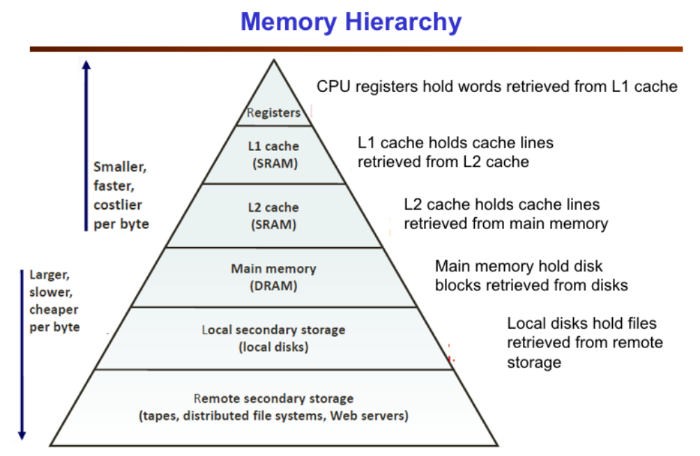
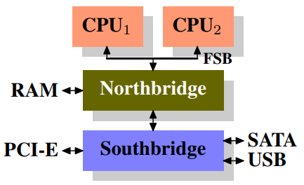

-----

| Title     | Hardware Memory                                    |
| --------- | -------------------------------------------------- |
| Created @ | `2021-11-11T12:14:04Z`                             |
| Updated @ | `2023-05-27T05:30:13Z`                             |
| Labels    | \`\`                                               |
| Edit @    | [here](https://github.com/junxnone/xwiki/issues/4) |

-----

# Memory

  - Access Methods
      - Random Access
      - Sequential Access
      - Direct Access
  - Main Memory
      - RAM: Random Access Memory
          - DRAM: Dynamic RAM
          - SRAM: Static RAM
          - NVRAM: Non-Volatile RAM
      - ROM: Read Only Memory

## Reference

  - [What Every Programmer Should Know About
    Memory](https://www.akkadia.org/drepper/cpumemory.pdf)
