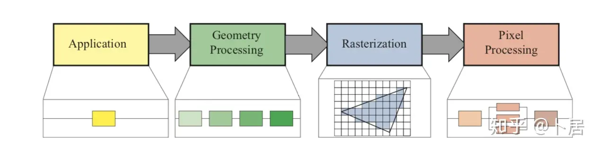

-----

| Title     | Hardware GPU NVIDIA                                |
| --------- | -------------------------------------------------- |
| Created @ | `2021-11-18T03:16:23Z`                             |
| Updated @ | `2023-07-14T01:39:12Z`                             |
| Labels    | \`\`                                               |
| Edit @    | [here](https://github.com/junxnone/xwiki/issues/6) |

-----

# NVIDIA GPU

  - GPC - `Graphics Processing Clusters` - 图形处理簇
  - TPC - `Texture Processing Clusters` - 纹理处理簇
  - SM - `Stream Multiprocessors` - 流多处理器
  - HBM2 - `High Bandwidth Memory Gen 2` - 高带宽存储器二代

## GPGPU

## Reference

  - [NVIDIA GPU 架构梳理](https://zhuanlan.zhihu.com/p/394352476)
