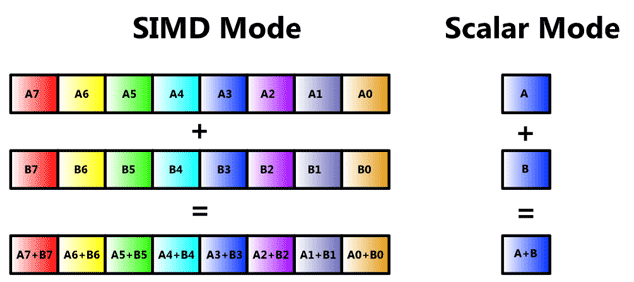

-----

| Title     | Hardware SIMD 原理                                   |
| --------- | -------------------------------------------------- |
| Created @ | `2021-08-02T02:42:03Z`                             |
| Updated @ | `2023-10-08T02:04:01Z`                             |
| Labels    | \`\`                                               |
| Edit @    | [here](https://github.com/junxnone/xwiki/issues/8) |

-----

# SIMD 原理

  - SIMD - `Single Instruction Multiple Data` - 单**指令流**多**数据流**
  - ALU - `arithmetic and logic unit` - 算术逻辑单元

## Scalar & SIMD Mode

## SIMD Arch

## Pipeline

## Reference

  - [SIMD简介](https://zhuanlan.zhihu.com/p/55327037)
  - [Basics of SIMD
    Programming](http://ftp.cvut.cz/kernel/people/geoff/cell/ps3-linux-docs/CellProgrammingTutorial/BasicsOfSIMDProgramming.html)
