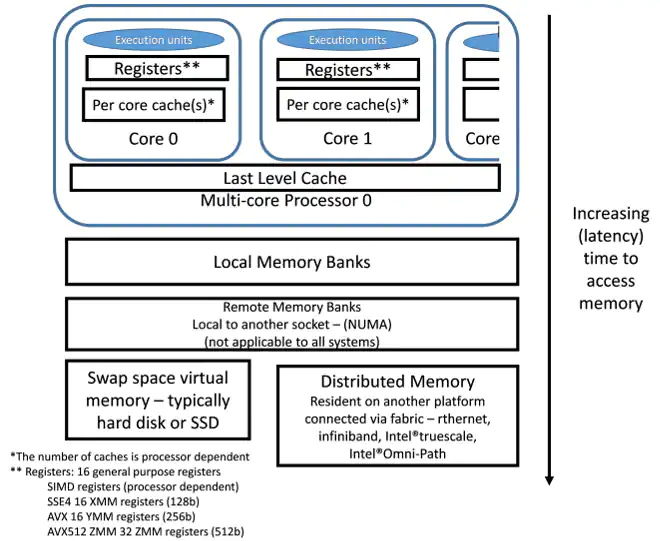
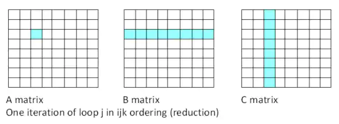
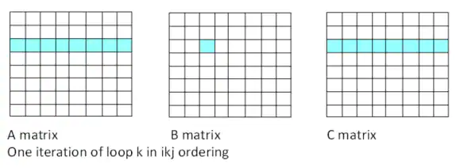
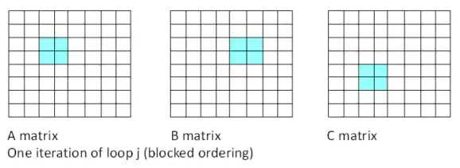
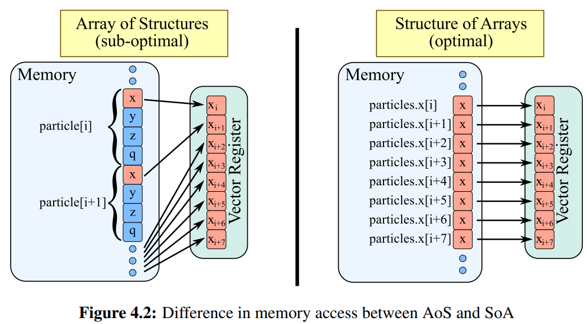
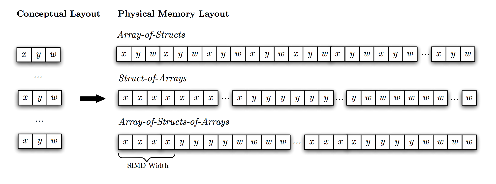

-----

| Title         | OPT Memory                                          |
| ------------- | --------------------------------------------------- |
| Created @     | `2021-11-15T08:35:48Z`                              |
| Last Modify @ | `2022-12-22T03:40:03Z`                              |
| Labels        | \`\`                                                |
| Edit @        | [here](https://github.com/junxnone/xwiki/issues/15) |

-----

# 内存优化

## Reference

  - [Introduction to Parallel Computing
    Tutorial](https://hpc.llnl.gov/training/tutorials/introduction-parallel-computing-tutorial)
  - [Putting Your Data and Code in Order: Optimization and Memory –
    Part 1](https://www.intel.com/content/www/us/en/developer/articles/technical/putting-your-data-and-code-in-order-optimization-and-memory-part-1.html)
  - [Putting Your Data and Code in Order: Data and layout -
    Part 2](https://www.intel.com/content/www/us/en/developer/articles/training/putting-your-data-and-code-in-order-data-and-layout-part-2.html)
  - [Data Alignment to Assist
    Vectorization](https://www.intel.com/content/www/us/en/developer/articles/technical/data-alignment-to-assist-vectorization.html)
  - [AoSoA](https://github.com/ECP-copa/Cabana/wiki/AoSoA)

## Brief

  - 两个基本原则
      - 最小化数据移动
      - 数据存储在离使用更近的地方
  - 使用优化函数库
      - BLAS - `Basic Linear Algebra Subprograms`
      - Intel MKL - `Math Kernel Library`
  - 内存带宽
  - False Sharing
  - SoA vs. AoS
  - [Cache Line Optimization](/Cache_Line_Optimization)

## Memory Arch

  - **按访问速度排序:** Registers/L1/L2/L3/DRAM(Local Memory)/`Remote
    Memory`/`Swap space virtual memory`(Hard Disk/SSD)



## Data Use and Reuse

### Loop Ordering

  - **i/j/k ordering**
  - Loop k 中将多个值融入一个值(reduction operation)不能有效利用 SIMD 的并行
  - 点积方法

<!-- end list -->

``` 
for (i=0;i<n; i++) 
   for (j = 0; j<n; j++) 
     for (k=0;k<n; k++) 
         A[i][j] += B[i][k]* C[k][j] ;  
```



  - **i/k/j ordering**
  - 改成如下循环顺序可以有效利用 SIMD 和寄存器
  - saxpy/daxpy
  - icx 在某些优化模式下会自动交换循环顺序

<!-- end list -->

    for (i=0;i<n; i++)
       for (k = 0; k<n; k++)
         for (j=0;j<n; j++)
           a[i][j] += b[i][k]* c[k][j] ;



### Data Reuse

  - 上述例子中, 当 n 比较大时, 中间循环读取到的 vectors 只能被使用一次
  - submatrices/blocksize
  - 选取适当的 blocksize, 使在内部三个循环中 block data 保存在 cache(Registers) 中
  - 只有在大数据时在有明显提升

<!-- end list -->

    for (i = 0; i < n; i+=blockSize)
       for (k=0; k<n ; k+= blockSize)   
          for (j = 0 ; j < n; j+=blockSize)      
             for (iInner = i; iInner<j+blockSize; iInner++)     
                for (kInner = k ; kInner<k+blockSize; kInner++)
                   for (jInner = j ; jInner<j+blockSize ; jInner++)
                     a[iInner,jInner] += b[iInner,kInner] *
                        c[kInner, jInner]



| Ordering  | Matrix/block size | Gcc\* 4.1.2 -O2speed up/ performance ratio over base | Intel compiler 16.1 -O2speed up/ performance ratio over base |
| --------- | ----------------- | ---------------------------------------------------- | ------------------------------------------------------------ |
| ijk       | 1600              | 1.0 (base)                                           | 12.32                                                        |
| ikj       | 1600              | 6.25                                                 | 12.33                                                        |
| ikj block | 1600/8            | 6.44                                                 | 8.44                                                         |
| ijk       | 4000              | 1.0 (base)                                           | 6.39                                                         |
| ikj       | 4000              | 6.04                                                 | 6.38                                                         |
| ikj block | 4000/8            | 8.42                                                 | 10.53                                                        |

### 数据对齐

  - 建议 64 byte 边界对齐
  - icx 支持不改源码编译 `align:rec64byte`

### Array of Structure vs. Structure of Array

  - SIMD 敏感, data 连续时 加载会更有效率
  - SDLT - SIMD 数据布局模板

<!-- end list -->

    struct {
       uint r, g, b, w ; 
    } MyAoS[N] ;

    struct {
       uint r[N] ;
       uint g[N] ;
       uint b[N] ;
       uint w[N] ;
    } MySoA ;

> SOA 更有效的加载到 SIMD 寄存器

|  |
| ------------------------------------------------------------ |
|  |

### 线程共享内存
