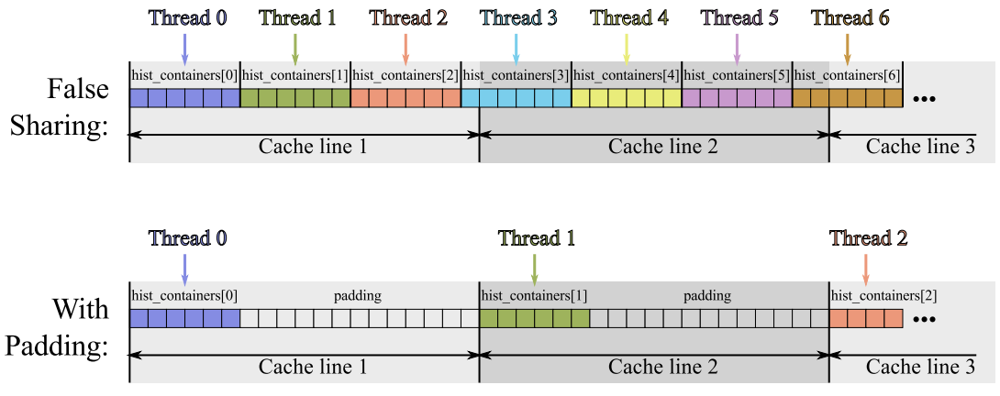

-----

| Title         | OPT Memory CacheLine                                |
| ------------- | --------------------------------------------------- |
| Created @     | `2022-04-27T02:59:04Z`                              |
| Last Modify @ | `2022-12-22T03:41:35Z`                              |
| Labels        | \`\`                                                |
| Edit @        | [here](https://github.com/junxnone/xwiki/issues/17) |

-----

## Reference

  - [CPU Cache
    Optimization](https://zzqcn.github.io/perf/cpu_cache.html)
    \[[code](https://github.com/zzqcn/storage/tree/main/code/c/cache_opt)\]
  - [伪共享（False Sharing）](https://zhuanlan.zhihu.com/p/55917869)
  - [False Sharing - Intel
    Vtune](https://www.intel.com/content/www/us/en/develop/documentation/vtune-cookbook/top/tuning-recipes/false-sharing.html)

## Brief

  - \[\[Cache\]\]
  - 结构体定义导致的每次 Cache 读取效率低
      - 结构体中包含无用变量
      - 结构体中的数据类型混排对齐
      - 数据行列访问
  - **False Sharing**: 多个线程访问同一 `cache line` 的不同数据

## Optimization

### 无用变量

  - 结构体中包含无用变量，导致读取到的有用数据减少，需要更多的读取时间

<!-- end list -->

    struct DATA1
    {
        int a;
        int b;
        int c;
        int d;
    };
    
    struct DATA2
    {
        int a;
        int b;
    };

| Define | 排列                                                           |
| ------ | ------------------------------------------------------------ |
| Data1  |  |
| Data2  |  |

### 数据类型混排对齐

  - 数据类型对齐导致的空间浪费，导致需要读取更多次数

<!-- end list -->

    struct DATA3
    {
        char a;
        int b;
        char c;
    };
    struct DATA4
    {
        int b;
        char a;
        char c;
    };

| Define | 排列                                                           |
| ------ | ------------------------------------------------------------ |
| Data3  |  |
| Data4  |  |

### 数据行列访问

  - 内存以行存储数据, 按行访问数据，每次 Cache 读取能够取到更多有效数据

<!-- end list -->

    // 按列访问
    char * p;
    p = new char[SIZE];
    for (long x=0; x<sRowSize; x++) {
        for (long y=0; y<nbRows; y++) {
            p[x+y*sRowSize]++;
        }
    }

    // 按行访问
    char * p;
    p = new char[SIZE];
    for (long y=0; y<nbRows; y++) {
        for (long x=0; x<sRowSize; x++) {
            p[x+y*sRowSize]++;
        }
    }

| Mode            | 按列访问                                                                                                                       | 按行访问                                                                                                                       |
| --------------- | -------------------------------------------------------------------------------------------------------------------------- | -------------------------------------------------------------------------------------------------------------------------- |
| Cache Line 读取区域 |  |  |

### False Sharing

