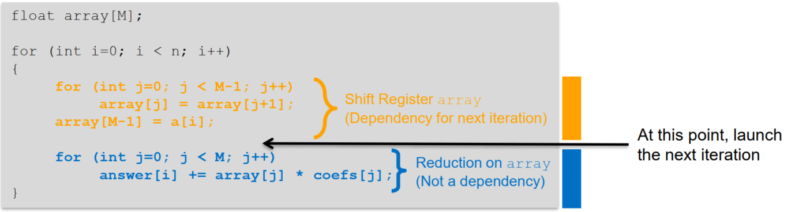
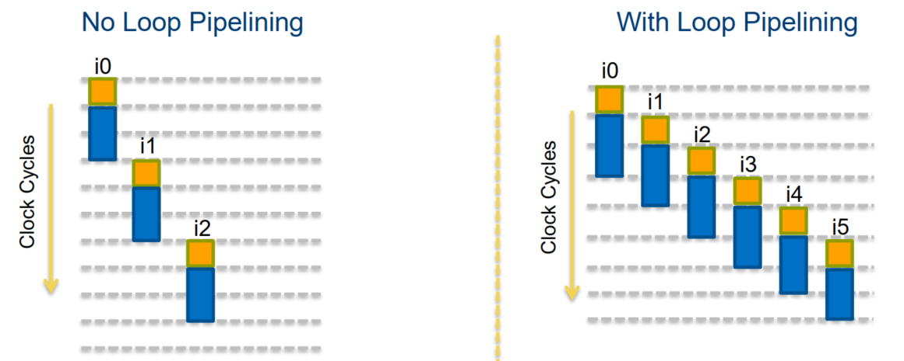
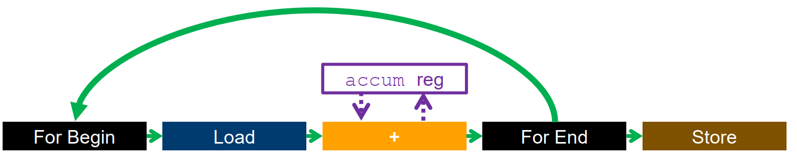
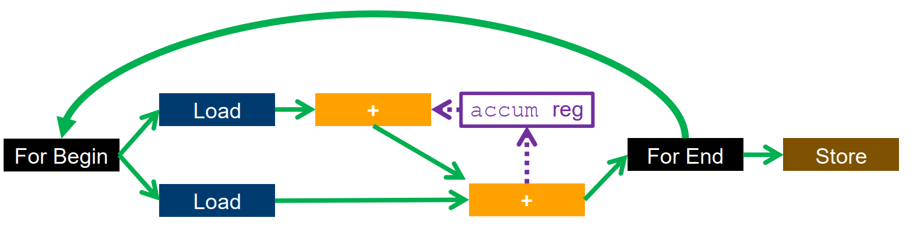
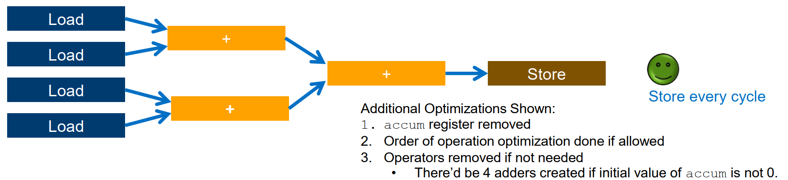
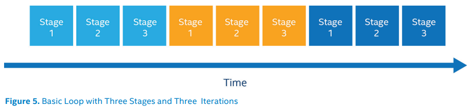
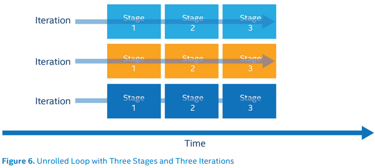
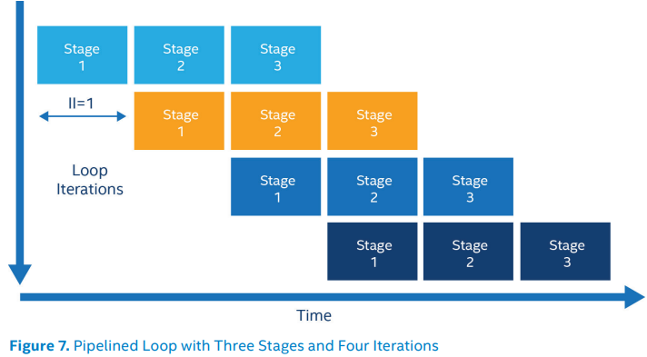

-----

| Title     | OPT Loop                                            |
| --------- | --------------------------------------------------- |
| Created @ | `2021-12-14T07:42:33Z`                              |
| Updated @ | `2023-08-26T06:58:46Z`                              |
| Labels    | \`\`                                                |
| Edit @    | [here](https://github.com/junxnone/xwiki/issues/18) |

-----

# Loop

  - 编译器可以自动优化一部分循环
  - Loop Pipelining
  - Loop Unrolling - 循环展开

## Loop Pipelining

| No Loop |  |
| ------------------------------------------------------------------- | ------------------------------------------------------------ |

## Loop Unrolling

  - 代码复制，用以减少循环分支指令执行的次数
  - 更多的指令级并行
  - 更多寄存器重用

<!-- end list -->

    accum = 0;
    #pragma unroll N
    for (size_t i=0; i<4; i++) {
      accum += data[i];
    }
    sum_out = accum;

| unroll/nounroll | Execution                                                    |
| --------------- | ------------------------------------------------------------ |
| nounroll        |  |
| Unroll 2        |  |
| Fully Unroll    |  |

| Basic Loop                                                   | Unrolled Loop                                                | Pipelined Loop                                               |
| ------------------------------------------------------------ | ------------------------------------------------------------ | ------------------------------------------------------------ |
|  |  |  |

## Reference

  - [HLS Loop
    Optimizations](https://learning.intel.com/developer/learn/course/external/view/elearning/242/hls-loop-optimizations-part-3-of-7)
  - [循环优化 -
    先进编译实验室](https://space.bilibili.com/1540261574/channel/collectiondetail?sid=693322)
