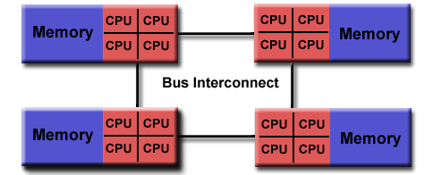
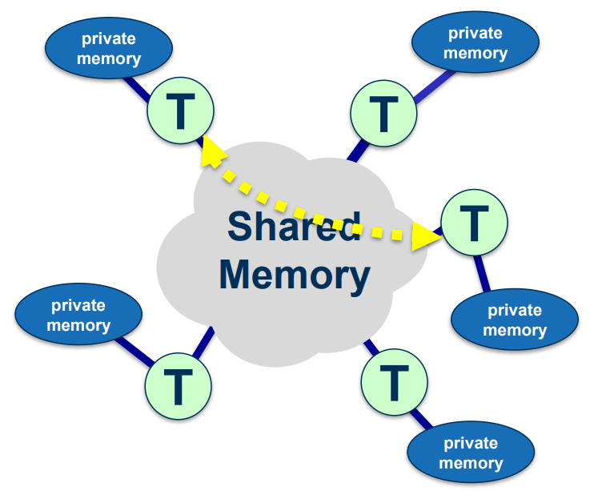

-----

| Title     | OPT PARA OpenMP                                     |
| --------- | --------------------------------------------------- |
| Created @ | `2021-05-20T03:29:59Z`                              |
| Updated @ | `2023-03-08T03:02:01Z`                              |
| Labels    | \`\`                                                |
| Edit @    | [here](https://github.com/junxnone/xwiki/issues/23) |

-----

## Reference

  - [OpenMP API Specification](https://www.openmp.org/specifications/)
  - [OpenMP Reference
    Guide](https://www.openmp.org/resources/refguides/)
  - [OpenMP Compilers &
    Tools](https://www.openmp.org/resources/openmp-compilers-tools/)
  - [OpenMP sample
    code](https://github.com/OpenMP/Examples/tree/main/sources)
    \[[examples notebook --
    passlab](https://passlab.github.io/Examples/intro.html)\]
  - [OpenMP学习笔记](https://blog.csdn.net/qq_40379678/article/details/107788716)
  - [并行计算 - 华东师范大学 ](http://math.ecnu.edu.cn/~jypan/Teaching/ParaComp/)
      - [lect04\_OpenMP01\_C.pdf](https://github.com/junxnone/tech-io/files/6613360/lect04_OpenMP01_C.pdf)
      - [lect04\_OpenMP02\_C.pdf](https://github.com/junxnone/tech-io/files/6613361/lect04_OpenMP02_C.pdf)
      - [lect04\_OpenMP03\_C.pdf](https://github.com/junxnone/tech-io/files/6613363/lect04_OpenMP03_C.pdf)
  - [OpenMP并行编程.pdf -
    中科院计算机网络信息中心](https://github.com/junxnone/tech-io/files/6986206/OpenMP.pdf)
  - [C/C++
    openMP并发编程](https://blog.csdn.net/qq_30024069/article/details/93355022)
  - [OpenMP Training
    video](https://www.youtube.com/watch?v=nE-xN4Bf8XI&list=PLLX-Q6B8xqZ8n8bwjGdzBJ25X2utwnoEG)
  - [HPC.NRW OpenMP Online
    Tutorial](https://hpc-wiki.info/hpc/OpenMP_in_Small_Bites)
  - [OpenMP Tutorial - Lawrence Livermore National Laboratory -
    OpenMP 3.1](https://hpc.llnl.gov/tuts/openMP/)
  - [Oracle\_OpenMP\_4.0\_Guide.pdf](https://github.com/junxnone/linuxwiki/files/7490883/Oracle_OpenMP_4.0_Guide.pdf)
  - [Portable\_Shared\_Memory\_Parallel\_Programming.pdf](https://github.com/junxnone/linuxwiki/files/7491145/Portable_Shared_Memory_Parallel_Programming.pdf)
  - [NUMA in
    OpenMP](https://www.openmp.org/wp-content/uploads/OpenMPBoothTalks-SC21-Ruud-NUMA.part_.1.pdf)

## Brief

  - OpenMP 是一个写 `shared memory parallel` 应用的规范
  - 规范定义的内容
      - Compiler Directives - 编译指令
      - Runtime routines - API
      - 环境变量
  - 具体实现由编译器实现, 不同厂家的编译器对 OpenMP 的支持不一样
      - MSVC 目前只支持 2.0 & 部分 4.0 feature (SIMD)(`@20211105`)
      - ICC/GCC 目前支持 4.5 & 部分 5.x (`@20211105`)
  - [OpenMP API](/OpenMP_API)
  - [OpenMP Usecase](/OpenMP_Usecase)
  - [OpenMP 变量](/OpenMP_变量)
  - [OpenMP 绑核](/OpenMP_Bind_Core)
  - [OpenMP SIMD](/OpenMP_SIMD)
  - [OpenMP Offload](/OpenMP_Offload)
  - [OpenMP Directives](OpenMP_Directives)
  - [OpenMP Task](/OpenMP_Task)

## Shared Memory Model

  - OpenMP 是为 多核/多处理器 共享内存的机器设计的
  - 支持 UMA/NUMA - `Uniform Memory Access` / `Non-Uniform Memory Access`

| UMA                                                          | NUMA                                                         |
| ------------------------------------------------------------ | ------------------------------------------------------------ |
|  |  |

## Fork-Join Model

  - Steps
      - 1 master thread 顺序执行到 `parallel region`
      - 2 master thread 创建 parallel threads 线程组 - **\[Fork\]**
      - 3 parallel threads 执行完等待其他线程, 同步并结束 - **\[Join\]**

## Memory Model

  - 每个 Thread 都有共享内存和私有内存

## History

  - 1997 OpenMP 1.0 for FORTRAN
  - 1998 OpenMP 1.0 for C and C++
  - 1999 OpenMP 1.1 for FORTRAN
  - 2000 OpenMP 2.0 for FORTRAN
  - 2002 OpenMP 2.0 for C and C++
  - 2005 OpenMP 2.5 now includes both programming languages.
  - 05/2008 OpenMP 3.0 Task Parallelism
  - 07/2011 OpenMP 3.1
  - 07/2013 OpenMP 4.0 SIMD Support
  - 11/2015 OpenMP 4.5
  - 11/2018 OpenMP 5.0 C11/C++17/Fortran 2008 Support
