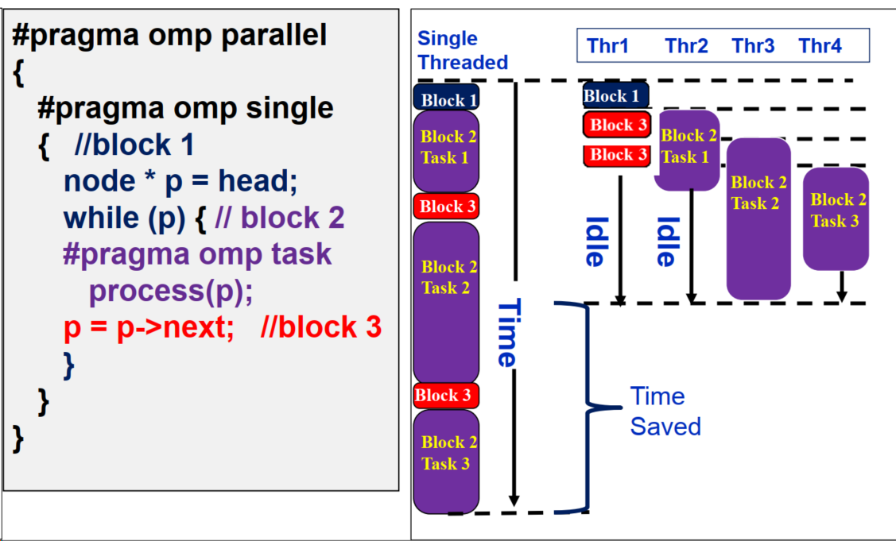

-----

| Title         | OPT PARA OpenMP Task                                |
| ------------- | --------------------------------------------------- |
| Created @     | `2021-11-18T08:03:50Z`                              |
| Last Modify @ | `2022-12-22T03:52:15Z`                              |
| Labels        | \`\`                                                |
| Edit @        | [here](https://github.com/junxnone/xwiki/issues/30) |

-----

## Reference

  - [Intro\_To\_OpenMP\_Mattson.pdf](https://github.com/junxnone/linuxwiki/files/7561048/Intro_To_OpenMP_Mattson.pdf)
  - [OpenMP学习笔记整理（二）——task](https://blog.csdn.net/huang_wifi/article/details/116047794)
  - [OpenMP
    Tasking](https://openmp.org/wp-content/uploads/sc15-openmp-CT-MK-tasking.pdf)
  - [OpenMP Task -
    Oracle](https://docs.oracle.com/cd/E19205-01/821-0393/6nletfa62/index.html)

## Brief

  - task 指令定义一个显示的任务，常用于递归调用

<!-- end list -->

    #pragma omp task [clause[ [,] clause] ... ] new-line 
        structured-block

  - **clause**

<!-- end list -->

    if([ task :] scalar-expression) 
    final(scalar-expression) 
    untied 
    default(shared | none) 
    mergeable 
    private(list) 
    firstprivate(list) 
    shared(list) 
    in_reduction(reduction-identifier : list) 
    depend([depend-modifier,] dependence-type : locator-list) 
    priority(priority-value) 
    allocate([allocator :] list) 
    affinity([aff-modifier :] locator-list) 
    detach(event-handle)

## Examples

