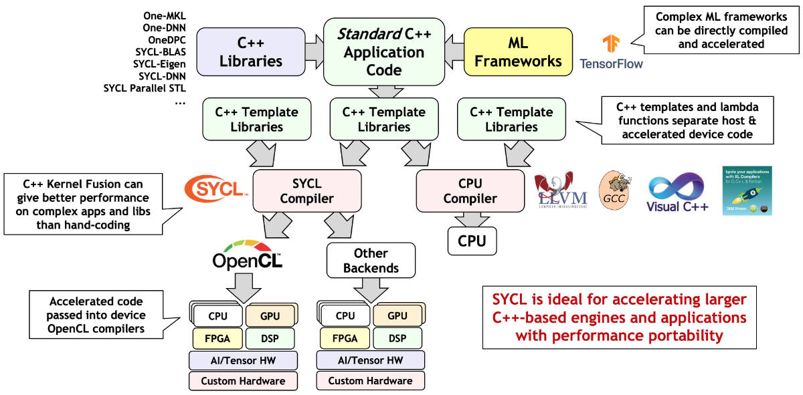
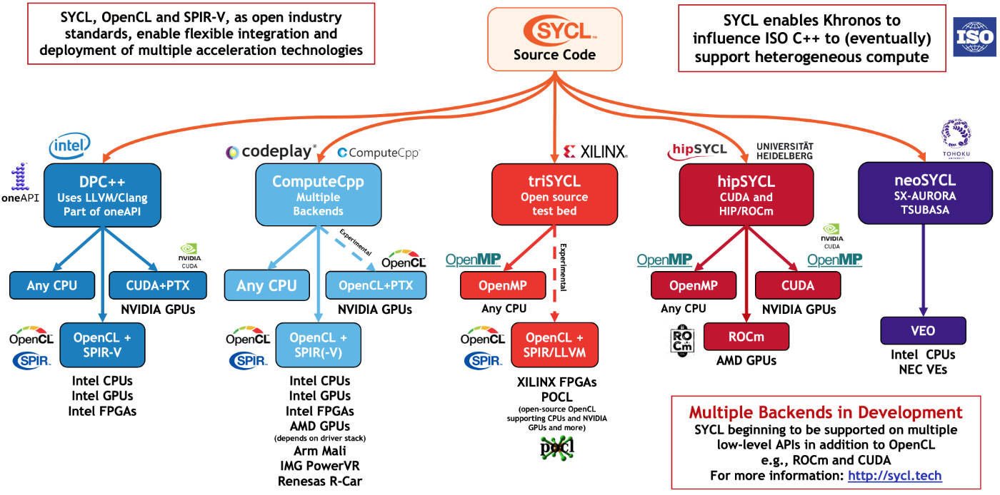
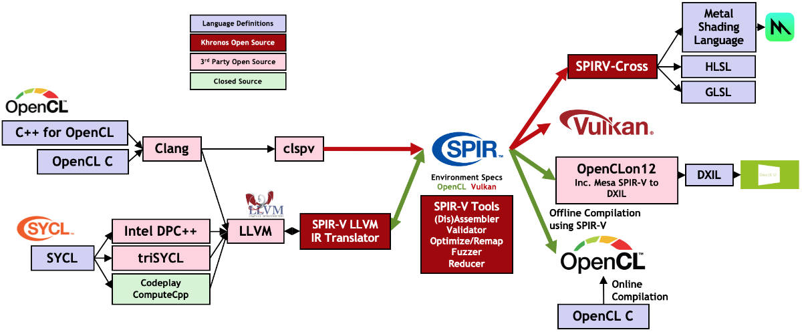
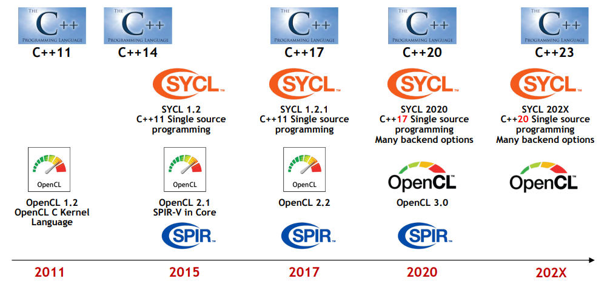

-----

| Title     | OPT PARA SYCL                                       |
| --------- | --------------------------------------------------- |
| Created @ | `2021-07-29T01:50:29Z`                              |
| Updated @ | `2023-03-08T02:54:59Z`                              |
| Labels    | \`\`                                                |
| Edit @    | [here](https://github.com/junxnone/xwiki/issues/31) |

-----

# SYCL

## Reference

  - [SYCL 官网](https://www.khronos.org/sycl/)
  - [SYCL
    Specification](https://www.khronos.org/registry/SYCL/specs/sycl-2020/html/sycl-2020.html#introduction)
  - [SYCL Reference](https://sycl.readthedocs.io/en/latest/)
  - [sycl.tech](https://sycl.tech/learn/)
  - [A Comparative Study of SYCL, OpenCL, and
    OpenMP](https://www.researchgate.net/publication/312964923_A_Comparative_Study_of_SYCL_OpenCL_and_OpenMP)
  - [Investigation of the OpenCL SYCL Programming
    Model](https://static.epcc.ed.ac.uk/dissertations/hpc-msc/2013-2014/Investigation%20of%20the%20OpenCL%20SYCL%20Programming%20Model.pdf)
  - [SYCL Academy
    Videos](https://www.youtube.com/watch?v=1RqdVEDY5vg&list=PLCssnq0MpRdM-IUAYtNSPYck6u3oz7OZQ)
    \[[Github/Slides/source](https://github.com/codeplaysoftware/syclacademy)\]

## Brief

  - SYCL - High-Level C++ 抽象层 - 一个标准, 可以使用 OpenCL backend 运行，也可以用其他库作为后端
    (CUDA/OpenMP/OpenCL+PTX/CUDA+PTX)
  - [SYCL Concepts](/SYCL_Concepts)
  - [SPIR](/SPIR)
  - SYCL 标准的一些实现
      - [DPCPP - Intel](https://github.com/intel/llvm)
      - [ComputeCpp -
        codeplay](https://github.com/codeplaysoftware/computecpp-sdk)
      - [TriSYCL - Xilinx](https://github.com/triSYCL/triSYCL)
      - [hipSYCL - Heidelberg
        University](https://github.com/illuhad/hipSYCL)
      - neoSYCL - Tohoku
  - [SYCL Projects](/SYCL_Projects)

> The SYCL platform model is based on the OpenCL platform model.

## SYCL 定位

## SYCL 实现

  - DPCPP - intel
  - ComputeCpp - codeplay
  - triSYCL - XILINX
  - hipSYCL - AMD
  - neoSYCL - Tomoku

## SYCL VS OpenCL

| Name   | Description                             |
| ------ | --------------------------------------- |
| SYCL   | \- High-Level  - 单一文件  - 编译为 SPIR |
| OpenCL | \- Low-Level  - Host + Device Code   |

## History

  - 2015 SYCL 1.2 \[C++ 11/OpenCL 2.1\]
  - 2017 SYCL 1.2.1 \[C++ 11/OpenCL 2.2\]
  - 2020 SYCL 2020 \[C++ 17/OpenCL 3.0\]

