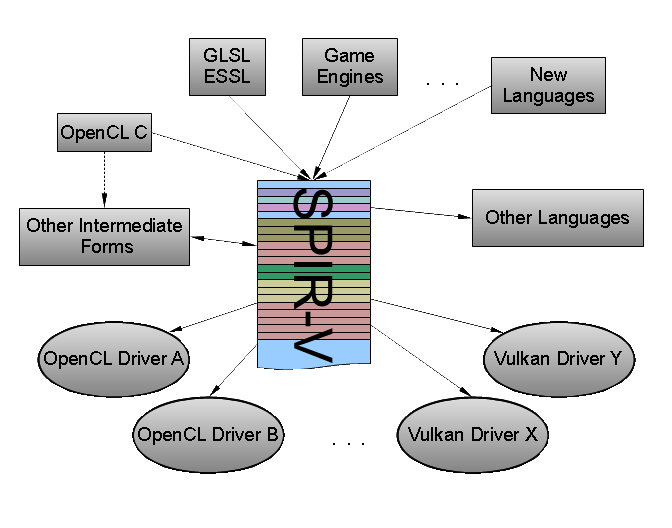
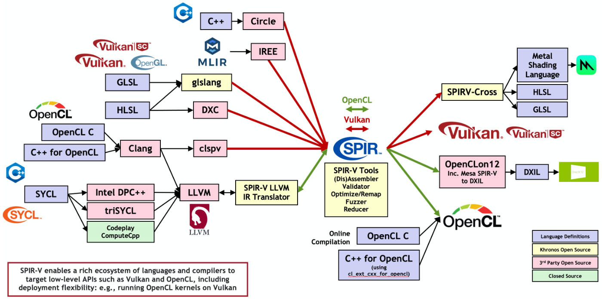
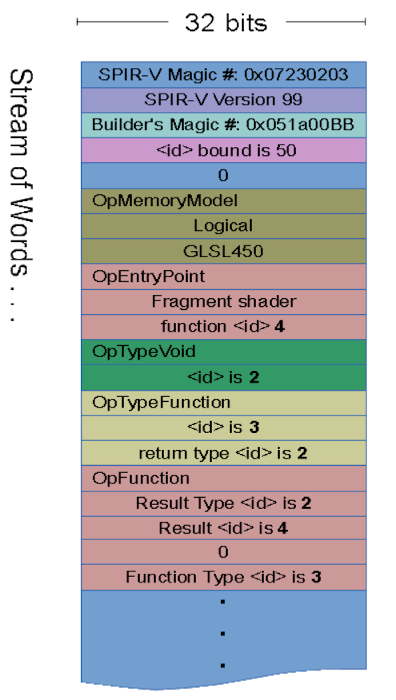
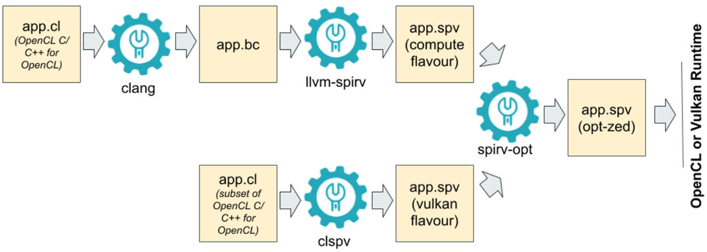
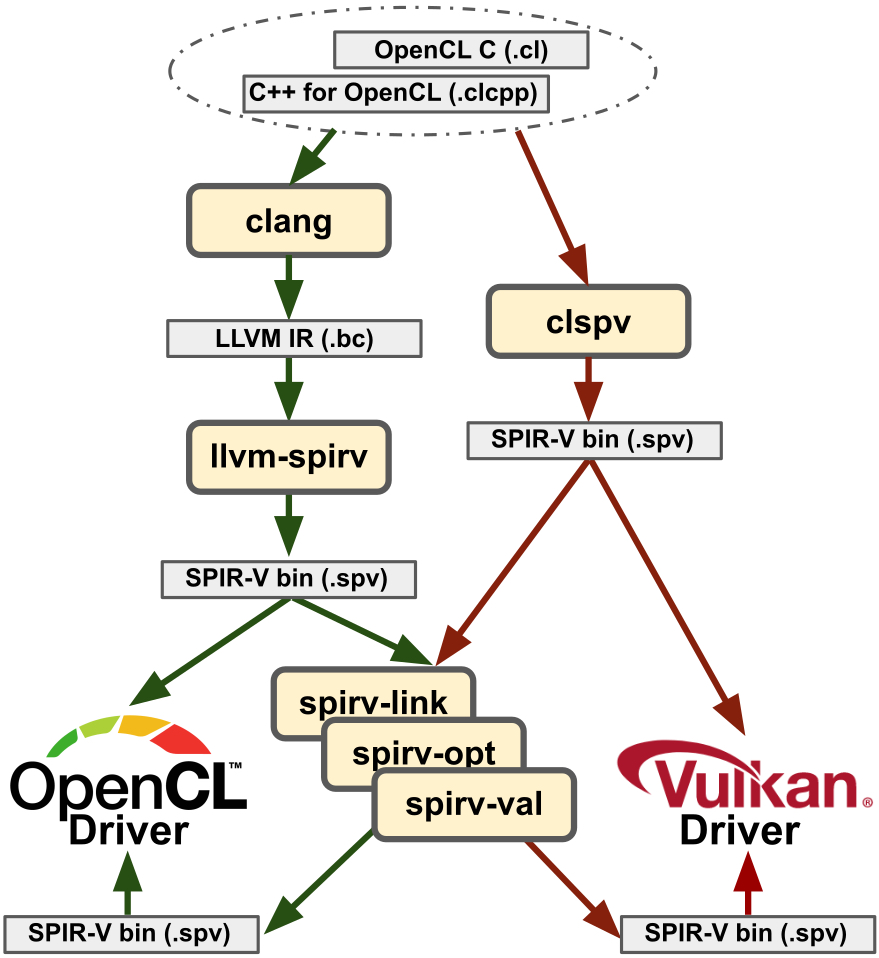

-----

| Title         | OPT PARA SYCL SPIR                                  |
| ------------- | --------------------------------------------------- |
| Created @     | `2021-07-29T02:23:07Z`                              |
| Last Modify @ | `2022-12-22T05:47:08Z`                              |
| Labels        | \`\`                                                |
| Edit @        | [here](https://github.com/junxnone/xwiki/issues/40) |

-----

## Reference

  - [SPIR - khronos](https://www.khronos.org/spir/)
  - [SPIR-V Registry](https://www.khronos.org/registry/SPIR-V/)
  - [SPIR-V Guide](https://github.com/KhronosGroup/SPIRV-Guide)
  - [SPIR-V
    specs](https://www.khronos.org/registry/SPIR-V/specs/unified1/SPIRV.html#_introduction)
  - [SPIR-V Tutorials - Google](https://github.com/google/spirv-tutor)

## Brief

  - **SPIR** - `Standard Portable Intermediate Representation` -
    `OpenCL`
  - **SPIR-V** - SPIR 升级版 - `OpenCL/OpenGL/Vulkan`
  - [Tools - SPIR Visualizer](https://www.khronos.org/spir/visualizer/)

## File Format

## OpenCL to SPIR-V

|  |  |
| ------------------------------------------------------------ | ------------------------------------------------------------ |

## History

  - 2012/8 SPIR 1.0
  - 2014/1 SPIR 1.2
  - 2014/6 SPIR 2.0
  - 2021/1 SPIR-V 1.5
