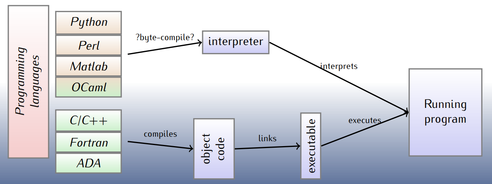
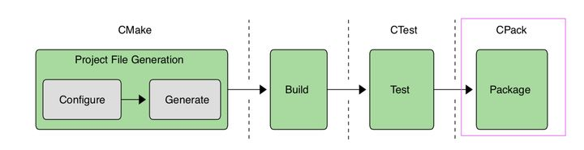
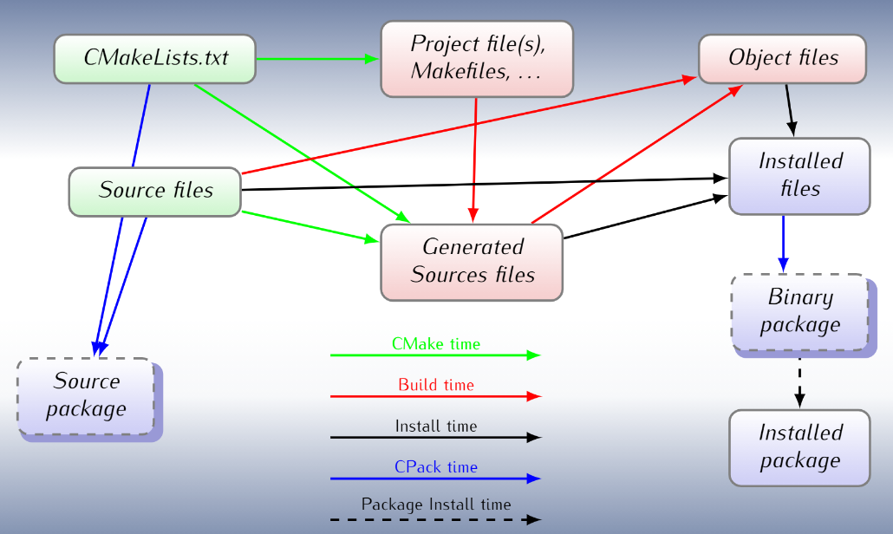

-----

| Title         | Build Cmake                                         |
| ------------- | --------------------------------------------------- |
| Created @     | `2018-09-02T08:05:59Z`                              |
| Last Modify @ | `2022-12-22T05:59:26Z`                              |
| Labels        | \`\`                                                |
| Edit @        | [here](https://github.com/junxnone/xwiki/issues/53) |

-----

## Reference

  - [Mastering
    CMake](https://cmake.org/cmake/help/book/mastering-cmake/index.html)
  - [2016-09-27-CMake-tutorial.pdf](https://github.com/junxnone/linuxwiki/files/7415584/2016-09-27-CMake-tutorial.pdf)
  - [CMake
    Tutorial](https://cmake.org/cmake/help/latest/guide/tutorial/index.html)
    \[[Tutorial
    Code](https://github.com/Kitware/CMake/tree/master/Help/guide/tutorial)\]
  - [Supported
    Compilers](https://cmake.org/cmake/help/git-master/manual/cmake-compile-features.7.html#supported-compilers)
  - [An Introduction to Modern
    CMake](https://cliutils.gitlab.io/modern-cmake/)
  - [More Modern CMake](https://github.com/Bagira80/More-Modern-CMake)
  - [CMake Cookbook](https://github.com/dev-cafe/cmake-cookbook)
  - [Awesome CMake](https://github.com/onqtam/awesome-cmake)
  - [CGold: The Hitchhiker’s Guide to the
    CMake](https://cgold.readthedocs.io/en/latest/index.html)
  - [cmake-examples-Chinese](https://sfumecjf.github.io/cmake-examples-Chinese/)

## Brief

  - **Build-System Generator** - 编译系统生成器(Not a Build-System)
      - 跨平台(Linux/Windows/OSX...)
  - [Install](./cmake_install)
  - [`CMakeLists.txt` 语法](./cmake_语法)
      - [cmake variables](/cmake_variables)
      - [cmake commands](/cmake_commands)
      - \[cmake condition\]
      - [cmake debug](/cmake_debug)
      - [cmake platforms](/cmake_platforms)
      - \[cmake target\]
      - \[cmake dependency\]
      - \[cmake interaction\]
      - [cmake install files](/cmake_install_files)
  - [Usecase](./cmake_usecase)
      - [cmake windows](/cmake_windows)
  - **Tools**
      - \[ctest\]
      - [cpack](/cpack)
      - \[ccmake\]
      - \[cmake-gui\]
  - [cmake Tutorial 分析](https://github.com/junxnone/CMake/issues/1)

## Supported

### Supported languages

  - C/C++/CUDA/HIP/OBJC/OBJC++

### Supported Compilers

  - AppleClang: Apple Clang for Xcode versions 4.4+.
  - Clang: Clang compiler versions 2.9+.
  - GNU: GNU compiler versions 4.4+.
  - MSVC: Microsoft Visual Studio versions 2010+.
  - SunPro: Oracle SolarisStudio versions 12.4+.
  - Intel: Intel compiler versions 12.1+.

### Supported Project Tools

  - Linux(`GNU make`/Ninja)
  - Windows(`Visual Studio`/nmake)
  - [Details](/cmake_generators)

## Cmake workflow

