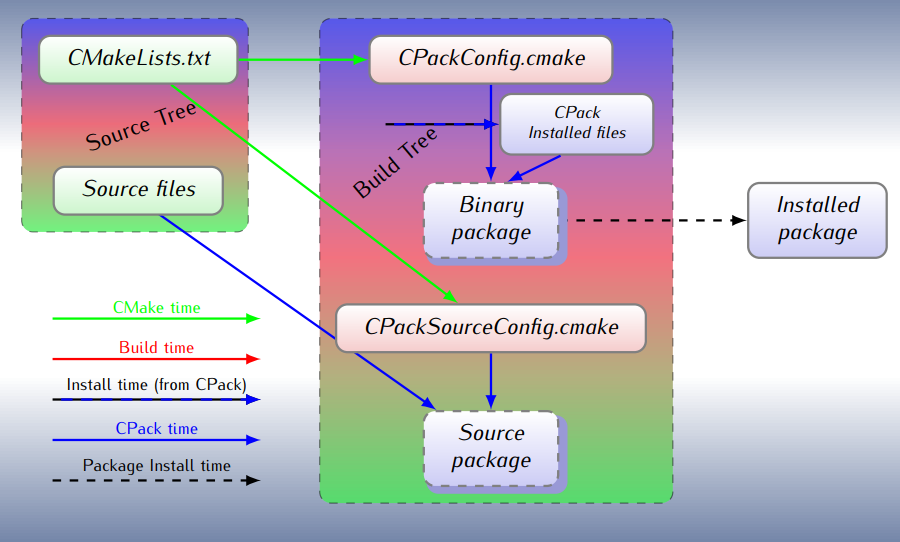

-----

| Title         | Build Cmake cpack                                   |
| ------------- | --------------------------------------------------- |
| Created @     | `2021-10-26T02:34:17Z`                              |
| Last Modify @ | `2022-12-22T06:09:59Z`                              |
| Labels        | \`\`                                                |
| Edit @        | [here](https://github.com/junxnone/xwiki/issues/62) |

-----

## Reference

  - [CPack 入门指南](https://zhuanlan.zhihu.com/p/141956373)
  - [cpack
    docs](https://cmake.org/cmake/help/latest/manual/cpack.1.html)
  - [cpack
    Configuration](https://gitlab.kitware.com/cmake/community/-/wikis/doc/cpack/Configuration)

## Breif

  - **cpack** - cmake 内置打包工具, 用于打包安装文件(可执行文件/库等)
  - 可以和 cmake 一起使用, 也可以单独使用
  - **CPack Package Generators**
  - 基于 [libarchive](https://github.com/libarchive/libarchive)

## Support Formats

  - 7Z (7-Zip file format)
  - **DEB (Debian packages)**
  - External (CPack External packages)
  - IFW (Qt Installer Framework)
  - NSIS (Null Soft Installer)
  - NSIS64 (Null Soft Installer (64-bit))
  - NuGet (NuGet packages)
  - **RPM (RPM packages)**
  - STGZ (Self extracting Tar GZip compression
  - TBZ2 (Tar GZip compression)
  - TXZ (Tar XZ compression)
  - TZ (Tar Compress compression)
  - ZIP (ZIP file format)

### Formats on OS

| Windows     | Cygwin         | Linux/UNIX  | Mac OS X     |
| ----------- | -------------- | ----------- | ------------ |
| NSIS        | CYGWIN\_BINARY | DEB         | PACKAGEMAKER |
| ZIP         | SOURCE\_CYGWIN | RPM         | DRAGANDROP   |
| SOURCE\_ZIP |                | STGZ        | BUNDLE       |
|             |                | TBZ2        | OSXX11       |
|             |                | TGZ         |              |
|             |                | TZ          |              |
|             |                | SOURCE\_TGZ |              |
|             |                | SOURCE\_TZ  |              |

## Cpack workflow

## 添加 script

  - preinst：安装前脚本文件
  - postinst：安装后脚本文件
  - prerm：卸载前文件
  - postrm：卸载后文件
