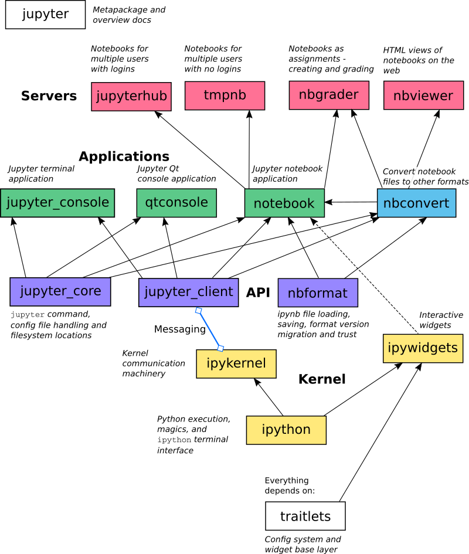

-----

| Title         | Tools Jupyter Arch                                  |
| ------------- | --------------------------------------------------- |
| Created @     | `2019-12-07T16:50:27Z`                              |
| Last Modify @ | `2022-12-22T06:16:21Z`                              |
| Labels        | \`\`                                                |
| Edit @        | [here](https://github.com/junxnone/xwiki/issues/69) |

-----

## Reference

  - [Jupyter在美团民宿的应用实践](https://tech.meituan.com/2019/11/21/application-practice-jupyter.html)
  - [Custom
    Magics](https://ipython.readthedocs.io/en/stable/config/custommagics.html)
  - [Custom
    Widget](https://ipywidgets.readthedocs.io/en/stable/examples/Widget%20Custom.html)

## Brief

  - JupyterLab：交互式执行的前端，开源项目。
  - Jupyter Server：交互式执行的后端，开源项目。
  - Commuter：浏览Notebook的工具，开源项目。

## IPython Magics

执行Magics时，事实上是调用了该Magics定义的一个函数

  - Line Magics（一个%），传入函数的是当前行的代码
  - Cell Magics（两个%），传入的是整个Cell的内容

## IPython Widgets

IPython Widgets是一种基于Jupyter Notebook和IPython的可交互控件
