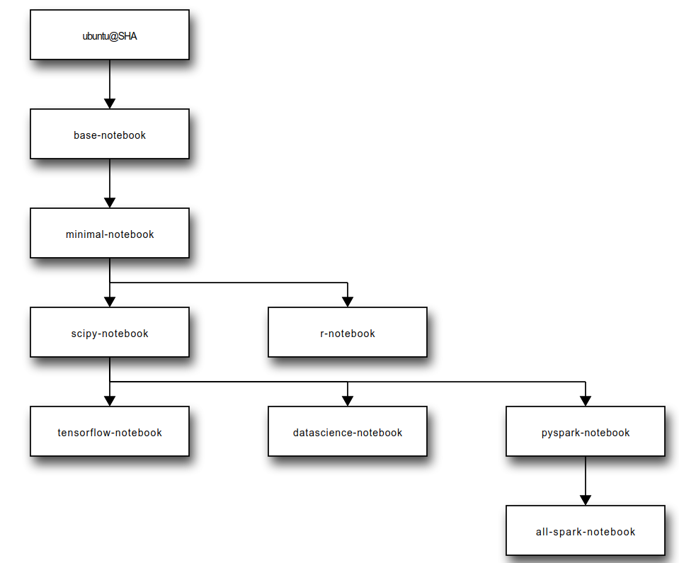

-----

| Title         | Tools Jupyter DockerImage                           |
| ------------- | --------------------------------------------------- |
| Created @     | `2019-09-08T09:40:40Z`                              |
| Last Modify @ | `2022-12-22T06:17:19Z`                              |
| Labels        | \`\`                                                |
| Edit @        | [here](https://github.com/junxnone/xwiki/issues/70) |

-----

# Docker Image

## Reference

  - [selecting docker
    images](https://jupyter-docker-stacks.readthedocs.io/en/latest/using/selecting.html)
  - [jupyter/docker-stacks](https://github.com/jupyter/docker-stacks)

## Images

**N.B.** 因为 NVIDIA license 原因，官方docker image 不支持 GPU

  - base-notebook
  - minimal-notebook
  - r-notebook
  - scipy-notebook
  - tensorflow-notebook
  - datascience-notebook
  - pyspark-notebook
  - all-spark-notebook

# 定制适合项目的 docker

  - [ ] pandas/numpy/matplotlib/sklearn/opencv
  - [ ] clone the work repo
  - [ ] mount the work folder
  - [ ] tensorflow/keras
  - [ ] gpu support
