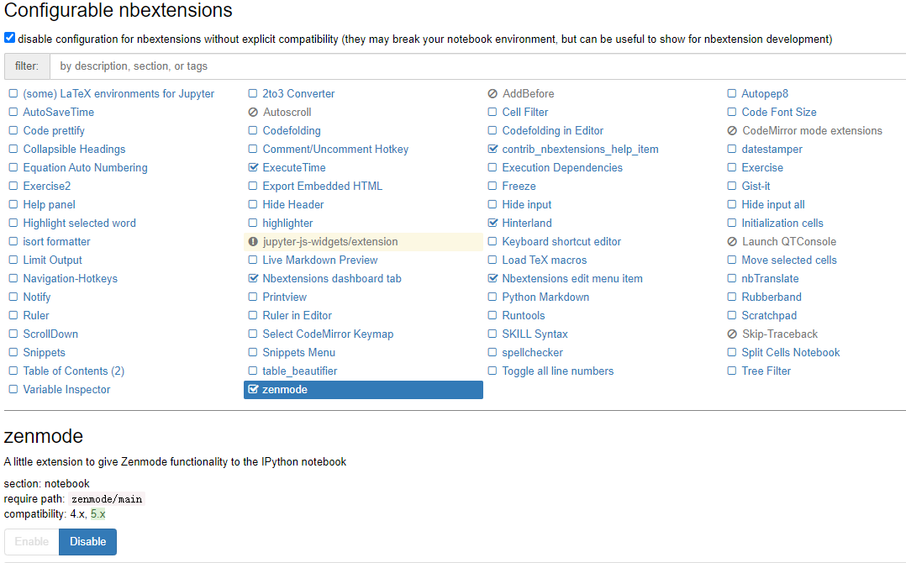
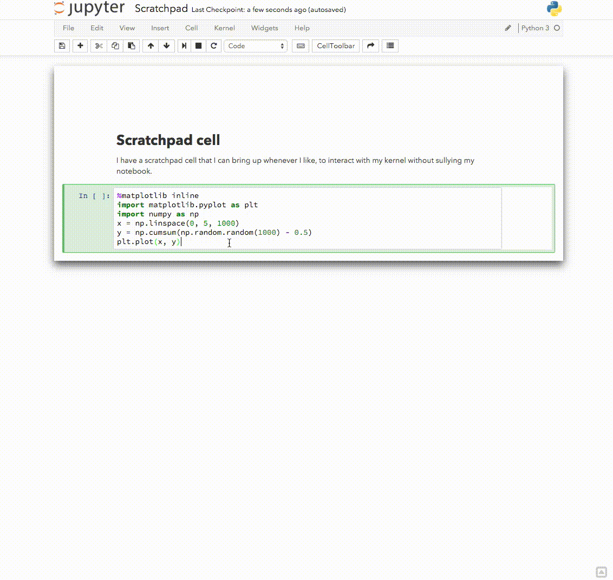
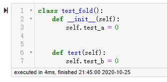
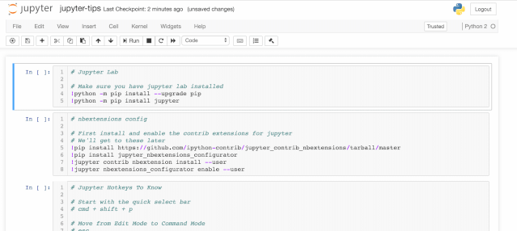
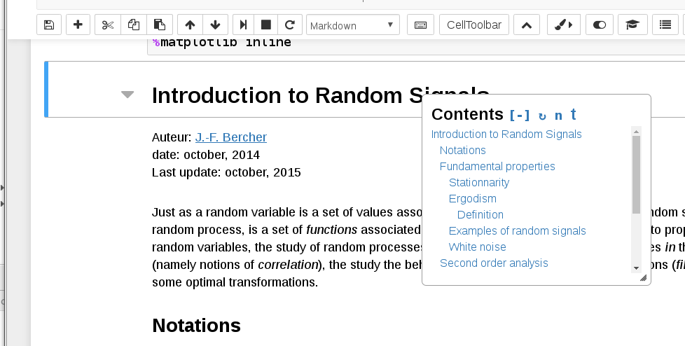
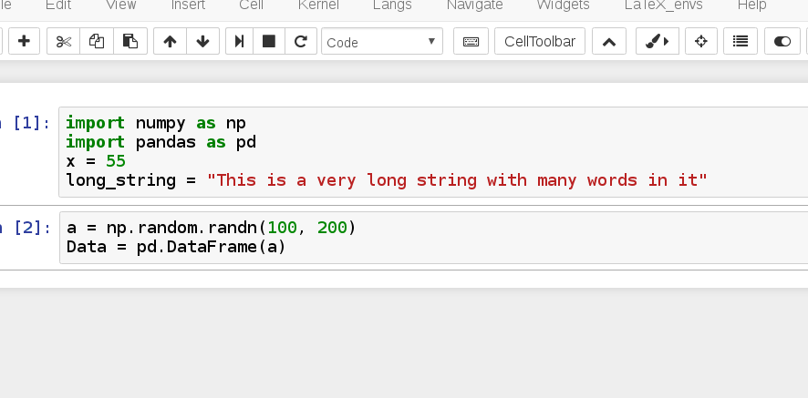

-----

| Title         | Tools Jupyter Extensions                            |
| ------------- | --------------------------------------------------- |
| Created @     | `2020-10-25T11:46:57Z`                              |
| Last Modify @ | `2022-12-22T06:18:05Z`                              |
| Labels        | \`\`                                                |
| Edit @        | [here](https://github.com/junxnone/xwiki/issues/71) |

-----

## Reference

  - [Unofficial Jupyter Notebook
    Extensions](https://jupyter-contrib-nbextensions.readthedocs.io/en/latest/)

## Brief

  - jupyter\_contrib\_nbextensions

## jupyter\_contrib\_nbextensions

    pip3 install --user jupyter_contrib_nbextensions

| UI |  |
| -- | ------------------------------------------------------------ |

| Name               | Description                                       | Use Case                                                          |
| ------------------ | ------------------------------------------------- | ----------------------------------------------------------------- |
| Scratchpad         | 打开测试用的 `Cell`   <kbd>Ctrl</kbd> + <kbd>b</kbd> |        |
| Code folding       | 折叠 `Code`                                         |  |
| zenmode            | 折叠菜单栏，最大化 `Code` 区域                               |           |
| Table of contents  | 产生侧边目录和文件头 `TOC`                                  |           |
| Variable Inspector | 显示全局变量                                            |           |
