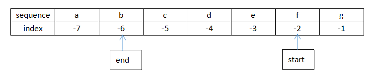
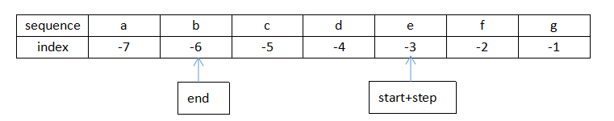
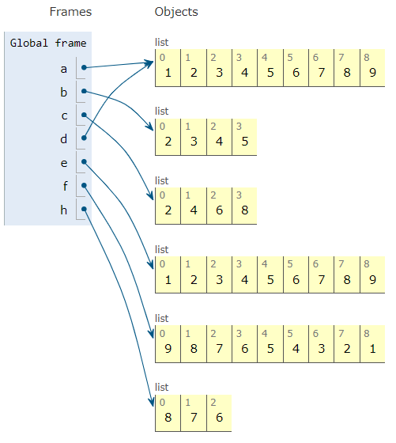

-----

| Title     | Programing Python Slice                             |
| --------- | --------------------------------------------------- |
| Created @ | `2019-05-14T14:34:29Z`                              |
| Updated @ | `2024-05-17T15:38:01Z`                              |
| Labels    | \`\`                                                |
| Edit @    | [here](https://github.com/junxnone/xwiki/issues/86) |

-----

# Python slice 切片 操作

| Pattern                               | Description                                    | UseCase       |
| ------------------------------------- | ---------------------------------------------- | ------------- |
| **seq**\[`s_index`:`e_index`\]        | 从 `s_index` 到 `e_index -1` 的切片                 | `s  == s[:]`  |
| **seq**\[`s_index`:`e_index`:`step`\] | 从 `s_index` 到 `e_index -1` 的切片, 每隔 `step` 取一次值 | `s[-2:-6:-1]` |

## Index

    s[-2:-6:-1]

> 不包括ending\_index

## UseCase

| UseCase         | Example                                                                                             | Description                         |
| --------------- | --------------------------------------------------------------------------------------------------- | ----------------------------------- |
| 多维(矩阵)          | `a[1:2, 2:3]`                                                                                       | 取第一维的`[2-3)`和第二维的`[3-5)`            |
| 翻转字符串 `::`      | `a[::-1]` == `a[-1:-len(a)-1:-1]`                                                                   | `s_index` & `e_index` 不指定 `step=-1` |
| 省略号 `…`         | `a[:, :, None]` == `a[…, None]`                                                                     | 省略其他维度                              |
| Image BGR-\>RGB | channels first `img = img[::-1, ...]`  channles last `img = img[..., ::-1]` == `img[:, :, ::-1]` |                                     |

## Examples

    a = [1,2,3,4,5,6,7,8,9]
    b = a[1:5]
    c = a[1:8:2]
    d = a
    e = a[:]
    f = a[::-1]
    h = a[-2:-5:-1]

## Reference

  - [python切片操作](https://www.cnblogs.com/mzct123/p/6031092.html)
  - [Understanding slice
    notation](https://stackoverflow.com/questions/509211/understanding-slice-notation)
