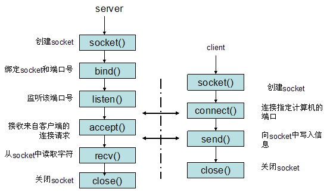

-----

| Title         | Programing Socket                                    |
| ------------- | ---------------------------------------------------- |
| Created @     | `2021-01-12T02:13:41Z`                               |
| Last Modify @ | `2022-12-22T06:45:45Z`                               |
| Labels        | \`\`                                                 |
| Edit @        | [here](https://github.com/junxnone/xwiki/issues/109) |

-----

## Reference

  - [socket 简介](http://c.biancheng.net/view/2123.html)
  - [socket samples](https://github.com/shineyr/Socket)

## Brief

  - Socket - 套接字
  - Server - Client
  - TCP/IP/UDP 传输层 之上
  - UNIX
      - `Open-Read-Write-Close` - `Connect-Recv-Send-Disconnect`

-----

|  |  |
| ------------------------------------------------------------ | ------------------------------------------------------------ |

## C API

| API                                                             | Description     | Server | Client |
| --------------------------------------------------------------- | --------------- | ------ | ------ |
| socket()                                                        | 创建 socket       | ✅      | ✅      |
| bind()                                                          | 绑定地址端口          | ✅      | ❌      |
| listen()                                                        | 监听              | ✅      | ❌      |
| accept()                                                        | 接受连接            | ✅      | ❌      |
| connect()                                                       | 尝试连接            | ❌      | ✅      |
| send()   write()  writev()  sendmsg()  sendto()     | 发送数据            | ✅      | ✅      |
| recv()   read()   writev()   recvmsg()   recvfrom() | 接收数据            | ✅      | ✅      |
| close()  shutdown()                                          | 关闭连接            |        |        |
| setsockopt() getsockopt()                                    | 设置/获取 socket 选项 |        |        |

### 创建 socket

`int socket(int domain, int type, int protocol)`

  - domain

| Parameters         | Description |
| ------------------ | ----------- |
| AF\_INET           | IPv4 地址     |
| AF\_INET6          | IPv6 地址     |
| AF\_LOCAL/AF\_UNIX | 绝对路径名       |
| AF\_ROUTE          |             |

  - type

| Parameters      | Description |
| --------------- | ----------- |
| SOCK\_STREAM    | 数据流         |
| SOCK\_DGRAM     | 数据报         |
| SOCK\_RAW       |             |
| SOCK\_PACKET    |             |
| SOCK\_SEQPACKET | 有序分组        |

  - protocol

| Parameters    | Description                            |
| ------------- | -------------------------------------- |
| IPPROTO\_TCP  | TCP传输协议 `Transmission Control Protocl` |
| IPPTOTO\_UDP  | UDP传输协议 `Unix Datagram Protocol`       |
| IPPROTO\_SCTP | STCP传输协议                               |
| IPPROTO\_TIPC | TIPC传输协议                               |

> SOCK\_STREAM不可以跟IPPROTO\_UDP组合

### Bind

`int bind(int sockfd, const struct sockaddr *addr, socklen_t addrlen)`
