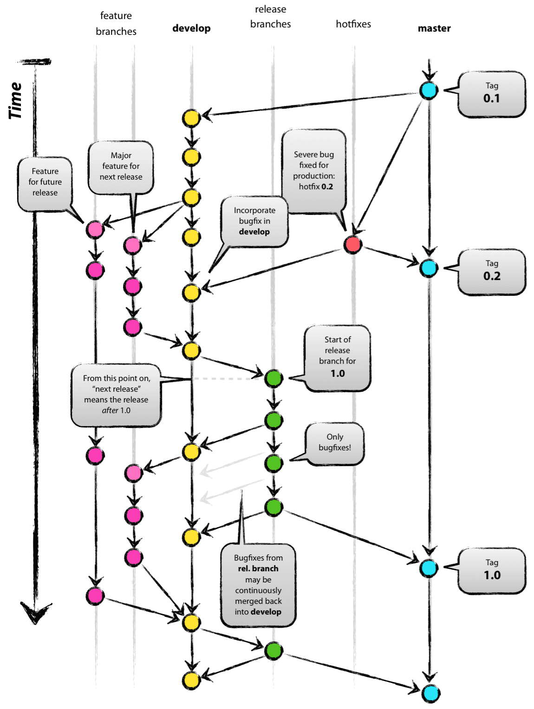

-----

| Title     | Tools Git branch                                     |
| --------- | ---------------------------------------------------- |
| Created @ | `2019-03-25T11:02:40Z`                               |
| Updated @ | `2023-07-11T03:38:07Z`                               |
| Labels    | \`\`                                                 |
| Edit @    | [here](https://github.com/junxnone/xwiki/issues/115) |

-----

# Git Branch

**分支介绍**

  - master/main ：这个分支的代码是发布到生产的代码
  - develop ：这个分支的代码是预发布到生产的代码
  - release ：这个分支的代码是新版本发布到生产的代码
  - feature ：这个分支的代码是新需求开发的代码
  - hotfix(bugfix) ：这个分支的代码是紧急修复生产 bug 的代码

## UseCase

| Usecase                           | 命令                                                                                                                 |
| --------------------------------- | ------------------------------------------------------------------------------------------------------------------ |
| 新建 Branch                         | `git branch dev`                                                                                                   |
| 列出当前 Branch                       | `git branch`                                                                                                       |
| 列出所有 Branch                       | `git branch -a`                                                                                                    |
| 列出所有 Remote Branch                | `git branch -r`                                                                                                    |
| 删除本地 Branch                       | `git branch -D branchname`                                                                                         |
| 删除 Remote Branch                  | `git branch -r -d origin/branch-name` `git push origin :branch-name`  `git push origin --delete branch_name` |
| 合并 Branch 到 Master                | `git checkout master` `git merge dev`                                                                           |
| Remote Branch 已删除 但 Local 仍能看到 | `git remote prune origin`                                                                                          |
| show all branch details           | `git show-branch`                                                                                                  |
| 命令行显示分支路线                         | `git log --graph --all --oneline`                                                                                  |
| push 当前 A 分支到远程 B 分支              | `git push origin branch_A:branch_B`                                                                                |

## Reference

  - [成熟的 Git 分支模型](https://my.oschina.net/liebrother/blog/2990683)
