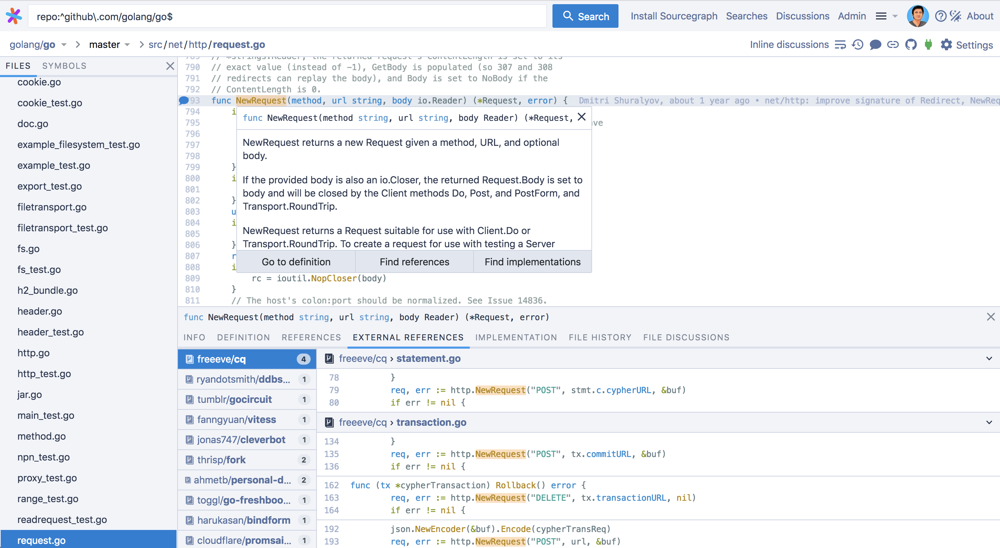

-----

| Title         | Tools Github ChromeExtensions Sourcegraph            |
| ------------- | ---------------------------------------------------- |
| Created @     | `2019-02-03T01:39:31Z`                               |
| Last Modify @ | `2022-12-22T06:55:21Z`                               |
| Labels        | \`\`                                                 |
| Edit @        | [here](https://github.com/junxnone/xwiki/issues/125) |

-----

## Reference

  - [官网](https://sourcegraph.com)
  - [Github repo](https://github.com/sourcegraph/sourcegraph)
  - [Docs](https://docs.sourcegraph.com/)
  - [sourcegraph
    方便的代码查看工具](https://www.cnblogs.com/rongfengliang/p/9299141.html)
  - [Online
    tool](https://sourcegraph.com/github.com/cockroachdb/cockroach)
  - [Migrating from Oracle OpenGrok to Sourcegraph for code
    search](https://docs.sourcegraph.com/admin/migration/opengrok)

## Brief

  - Sourcegraph is a free, open-source, self-hosted code search and
    navigation tool for developers.

