-----

| Title         | Tools Github Pages ReadmeStats                       |
| ------------- | ---------------------------------------------------- |
| Created @     | `2021-02-08T03:53:53Z`                               |
| Last Modify @ | `2022-12-22T07:01:24Z`                               |
| Labels        | \`\`                                                 |
| Edit @        | [here](https://github.com/junxnone/xwiki/issues/127) |

-----

# README Stats

## Reference

  - [GitHub Readme
    Stats](https://github.com/anuraghazra/github-readme-stats#github-extra-pins)

## Brief

| Name               | Demo Show                                                                                                              |
| ------------------ | ---------------------------------------------------------------------------------------------------------------------- |
| GitHub Stats Card  |                                              |
| Top Languages Card |                         |
| GitHub Extra Pins  |  |

  - Code

| Name           | Code                                                                                                                                                                                                                     |
| -------------- | ------------------------------------------------------------------------------------------------------------------------------------------------------------------------------------------------------------------------ |
| Stats Card     | ``                                                                                                        |
| Languages Card | `` |
| Extra Pins     | ``                                                        |

## Tags

| Type | Tags                                                    | Link                                                          |
| ---- | ------------------------------------------------------- | ------------------------------------------------------------- |
| 技能   |  | ``    |
| 学习中  |  | ``     |
| 喜欢   |  | ``        |
| 已废   |  | `` |
| 自定义  | [❤](https://shields.io/)                                | [❤](https://shields.io/)                                      |
