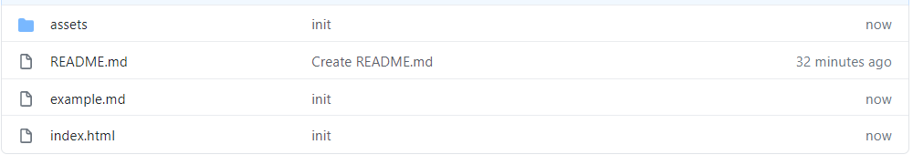
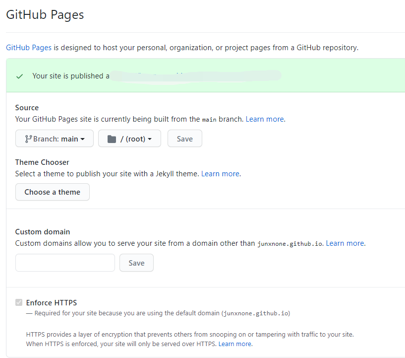

-----

| Title         | Tools Github Pages Markline                          |
| ------------- | ---------------------------------------------------- |
| Created @     | `2021-02-07T11:41:15Z`                               |
| Last Modify @ | `2022-12-22T07:04:03Z`                               |
| Labels        | \`\`                                                 |
| Edit @        | [here](https://github.com/junxnone/xwiki/issues/131) |

-----

# Markline Timeline

## Reference

  - [code](https://github.com/hotoo/markline)

## Brief

## ~~Install~~

> 可以不用安装, 直接使用
> [template](https://github.com/hotoo/markline/tree/master/template)

    sudo apt install npm
    npm install markline -g

## Deploy

| Num | Steps                | Description                                                       |
| --- | -------------------- | ----------------------------------------------------------------- |
| 1   | Create Repo          | 创建相关仓库                                                            |
| 2   | 设置 Repo              | Settings 设置 Github Pages 对应的branch                                |
| 3   | Copy 相关文件            | `assets` & `index.html`                                           |
| 4   | 创建 markdown          | 参考 [Format](https://github.com/hotoo/life/blob/gh-pages/hotoo.md) |
| 5   | 更改 `index.html` 部分内容 | `{FILE_NANE}` ==\> `your_markdown`                                |

|  |  |
| ------------------------------------------------------------ | ------------------------------------------------------------ |

## Support Features

  - 粗体
  - 时间线内隐藏时间点或时间段
  - Tags
  - 可以一个仓库创建多条 `timeline web`, 参考 [这里](https://github.com/junxnone/ht)

> 格式可以参考 [这里](https://github.com/junxnone/template_ht_markline)
