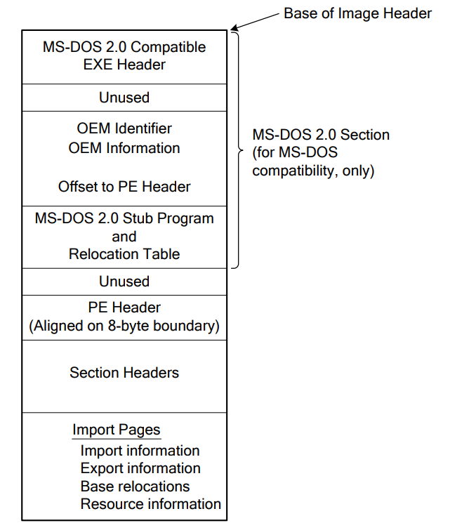
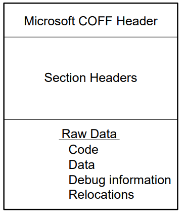

-----

| Title         | X PECOFF                                             |
| ------------- | ---------------------------------------------------- |
| Created @     | `2022-01-06T03:18:02Z`                               |
| Last Modify @ | `2022-12-22T07:28:15Z`                               |
| Labels        | \`\`                                                 |
| Edit @        | [here](https://github.com/junxnone/xwiki/issues/152) |

-----

## Reference

  - [Microsoft Portable Executable and Common Object File Format
    Specification - Revision 8.3 (6th
    Feb, 2013).pdf](https://github.com/tpn/pdfs/blob/master/Microsoft%20Portable%20Executable%20and%20Common%20Object%20File%20Format%20Specification%20-%20Revision%208.3%20\(6th%20Feb%2C%202013\).pdf)
    [\[docx\]](https://raw.githubusercontent.com/tpn/pdfs/master/Microsoft%20Portable%20Executable%20and%20Common%20Object%20File%20Format%20Specification%20-%20Revision%208.3%20\(6th%20Feb%2C%202013\).docx)

## Brief

  - PE executable
  - COFF Object-Module

## PE Executable

## COFF

### File Headers

  - COFF File Header(Object and Image)
  - Optional Header(Image Only)

### Section Table

| Section Name | Content                                                                                                                                                 |
| ------------ | ------------------------------------------------------------------------------------------------------------------------------------------------------- |
| .bss         | Uninitialized data (free format)                                                                                                                        |
| .cormeta     | CLR metadata that indicates that the object file contains managed code                                                                                  |
| .data        | Initialized data (free format)                                                                                                                          |
| .debug$F     | Generated FPO debug information (object only, x86 architecture only, and now obsolete)                                                                  |
| .debug$P     | Precompiled debug types (object only)                                                                                                                   |
| .debug$S     | Debug symbols (object only)                                                                                                                             |
| .debug$T     | Debug types (object only)                                                                                                                               |
| .drective    | Linker options                                                                                                                                          |
| .edata       | Export tables                                                                                                                                           |
| .idata       | Import tables                                                                                                                                           |
| .idlsym      | Includes registered SEH (image only) to support IDL attributes. For information, see “IDL Attributes” in “References” at the end of this specification. |
| .pdata       | Exception information                                                                                                                                   |
| .rdata       | Read-only initialized data                                                                                                                              |
| .reloc       | Image relocations                                                                                                                                       |
| .rsrc        | Resource directory                                                                                                                                      |
| .sbss        | GP-relative uninitialized data (free format)                                                                                                            |
| .sdata       | GP-relative initialized data (free format)                                                                                                              |
| .srdata      | GP-relative read-only data (free format)                                                                                                                |
| .sxdata      | Registered exception handler data (free format and x86/object only)                                                                                     |
| .text        | Executable code (free format)                                                                                                                           |
| .tls         | Thread-local storage (object only)                                                                                                                      |
| .tls$        | Thread-local storage (object only)                                                                                                                      |
| .vsdata      | GP-relative initialized data (free format and for ARM, SH4, and Thumb architectures only)                                                               |
| .xdata       | Exception information (free format)                                                                                                                     |
