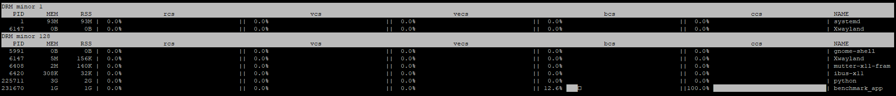
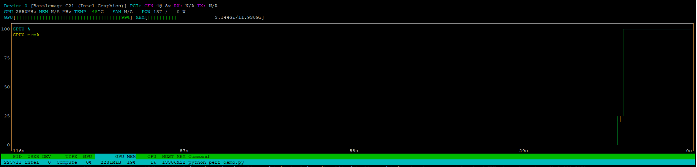

-----

| Title     | Hardware GPU iGPU Tools                              |
| --------- | ---------------------------------------------------- |
| Created @ | `2021-12-13T11:35:31Z`                               |
| Updated @ | `2025-05-30T07:43:45Z`                               |
| Labels    | \`\`                                                 |
| Edit @    | [here](https://github.com/junxnone/xwiki/issues/153) |

-----

# Intel iGPU Tools

  - inxi
  - lspci
  - intel\_gpu\_top
  - [Intel® GPU Occupancy
    Calculator](https://oneapi-src.github.io/oneAPI-samples/Tools/GPU-Occupancy-Calculator/index.html)
  - [Intel(R) XPU Manager and XPU System Management
    Interface](https://github.com/intel/xpumanager/tree/master)
  - gputop
  - nvtop

> i915 driver 向 xe driver 过渡过程中，一些GPU 功能支持会受影响

## 查看 iGPU 硬件信息

    inxi -G

    ls -al /dev/dri

    sudo lspci -v -s $(lspci | grep VGA | cut -d" " -f 1)

    $ lspci |grep VGA
    00:02.0 VGA compatible controller: Intel Corporation Device 9a49 (rev 01)

> 9a49 mean `Intel® Iris® Xe Graphics`, others you can found
> [here](https://dgpu-docs.intel.com/devices/hardware-table.html)

## 查看 iGPU 状态

### intel\_gpu\_top

    sudo apt install intel-gpu-tools
    sudo intel_gpu_top

#### 不用 sudo 执行 intel\_gpu\_top

    setcap cap_perfmon=+ep /usr/bin/intel_gpu_top
    sudo sh -c 'echo 2 >/proc/sys/kernel/perf_event_paranoid'

### gputop

### nvtop

  - [code](https://github.com/Syllo/nvtop)

## Reference

  - [intel-gpu-tools](https://cgit.freedesktop.org/xorg/app/intel-gpu-tools/)
