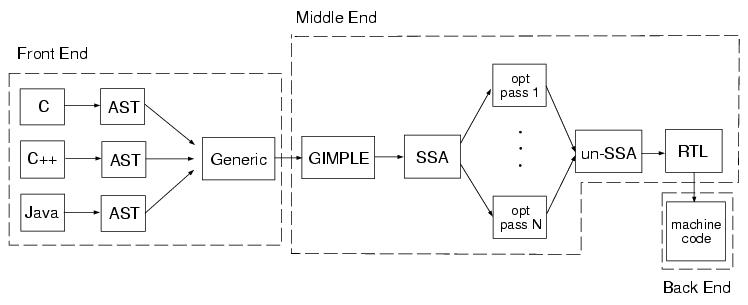

-----

| Title         | Programing Compiler GCC                              |
| ------------- | ---------------------------------------------------- |
| Created @     | `2021-07-21T05:45:57Z`                               |
| Last Modify @ | `2022-12-22T07:31:44Z`                               |
| Labels        | \`\`                                                 |
| Edit @        | [here](https://github.com/junxnone/xwiki/issues/159) |

-----

## Reference

  - [gcc](https://gcc.gnu.org/) \[[wiki](https://gcc.gnu.org/wiki)\]
    \[[GCC online documentation](https://gcc.gnu.org/onlinedocs/)\]
  - [GNU C Compiler Internals/GNU C Compiler
    Architecture](https://en.wikibooks.org/wiki/GNU_C_Compiler_Internals/GNU_C_Compiler_Architecture)
  - [Language Standards Supported by
    GCC](https://gcc.gnu.org/onlinedocs/gcc/Standards.html#Go-Language)
  - [History Timeline](https://gcc.gnu.org/develop.html#timeline)

## Brief

  - GCC - GNU Compiler Collection
  - **Supported Languages:** C/C++/Objective-C/Objective-C++/Go/Fortran
  - [GCC UseCase](/GCC_UseCase)

## WorkFlow

  - AST - `abstract syntax tree`
  - SSA - `static single assignment`
  - RTL - `register-transfer language`

## History

  - 1985 Richard Stallman starts GCC as GNU C Compiler
  - 1991 GCC 1.x =\> GCC 2.x
  - 1997 EGCS fork
  - 1999 EGCS becomes official GCC 2.95 with GCC Steering Committee
  - 2001 GCC 3.x
  - 2005 GCC 4.x then from 6 month to one year release
  - 2020 GCC11

[gist: history
timeline](https://gist.githubusercontent.com/junxnone/02e8a6a9e657bedb79f10639009b9e4d/raw/gcc_history_timeline.txt ":include :type=code")
