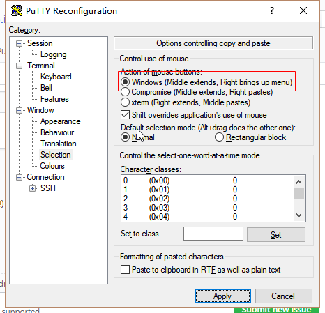
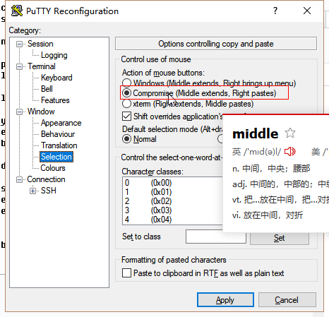
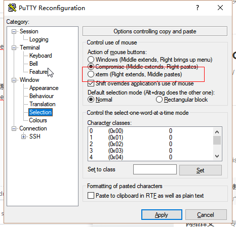

-----

| Title         | Tools putty                                          |
| ------------- | ---------------------------------------------------- |
| Created @     | `2018-11-25T10:08:11Z`                               |
| Last Modify @ | `2022-12-22T07:33:55Z`                               |
| Labels        | \`\`                                                 |
| Edit @        | [here](https://github.com/junxnone/xwiki/issues/161) |

-----

## Reference

  - [在windows上使用PUTTY,Xming设置X11
    forwarding](http://blog.sina.com.cn/s/blog_13a26718a0102v3bg.html)

## Brief

  - TODO
      - [ ] X11 + Xming ==\> Windows UI

## 复制黏贴模式

| 选项     | Windows                                                      | Compromise (**Default**)                                     | Xterm                                                        |
| ------ | ------------------------------------------------------------ | ------------------------------------------------------------ | ------------------------------------------------------------ |
| 复制黏贴方法 | \- 复制 左键选择  - 黏贴 右键弹出菜单                                   | \- 复制 中键选择复制 - 黏贴 右键按键黏贴                                  | \- 复制 右键选择 - 黏贴 中键黏贴                                      |
| 设置     |  |  |  |
