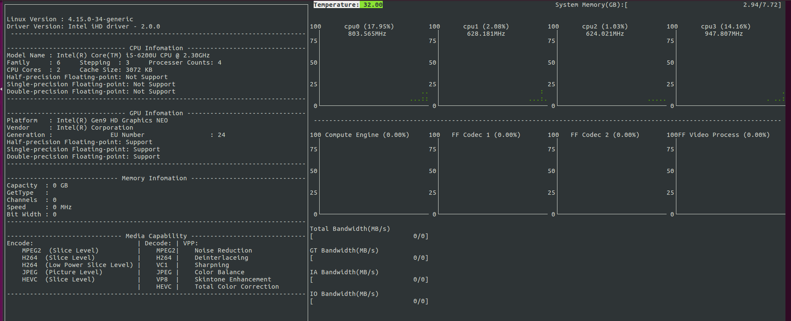

-----

| Title     | Hardware GPU iGPU Tools telemetry                    |
| --------- | ---------------------------------------------------- |
| Created @ | `2018-09-27T02:18:25Z`                               |
| Updated @ | `2024-04-07T03:08:30Z`                               |
| Labels    | \`\`                                                 |
| Edit @    | [here](https://github.com/junxnone/xwiki/issues/171) |

-----

# intel-telemetry-tool

  - CPU/GPU evaluate calculation capability Tool Kit

## Build & Install

    git clone https://github.com/Xiaogang-Li/intel-telemetry-tool.git
    cd intel-telemetry-tool/build
    ./prebuild.sh
    cd ..
    ./build.sh
    sudo cp telemetry /usr/bin/

## UseCase

    sudo telemetry

  - s : show statistics

## Reference

  - [intel-telemetry-tool](https://github.com/Xiaogang-Li/intel-telemetry-tool)
