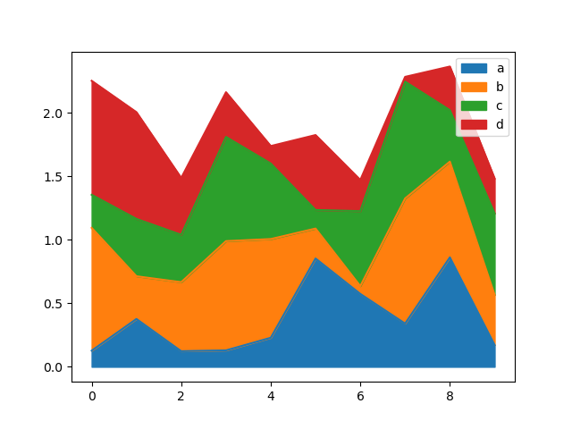

-----

| Title         | Pandas Visualization                                 |
| ------------- | ---------------------------------------------------- |
| Created @     | `2020-04-07T07:07:53Z`                               |
| Last Modify @ | `2022-12-22T08:19:27Z`                               |
| Labels        | \`\`                                                 |
| Edit @        | [here](https://github.com/junxnone/xwiki/issues/189) |

-----

# 可视化

## Reference

  - [pandas
    Visualization](https://pandas.pydata.org/pandas-docs/stable/user_guide/visualization.html)
  - [pandas Visualization-
    apachecn](http://pandas.apachecn.org/visualization.html)

## Brief

|  |  |  |
| ------------------------------------------------------------ | ------------------------------------------------------------ | ------------------------------------------------------------ |
|  |  |  |
|  |  |  |
|  |  |  |
|  |  |  |
|  |                                                              |                                                              |
