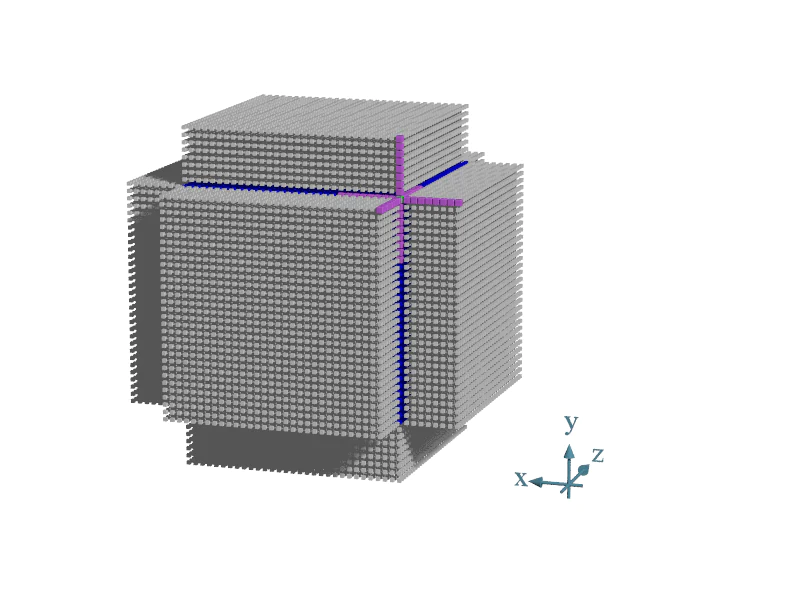

-----

| Title     | X iso3dfd                                            |
| --------- | ---------------------------------------------------- |
| Created @ | `2021-11-08T08:44:04Z`                               |
| Updated @ | `2024-12-31T01:51:57Z`                               |
| Labels    | \`\`                                                 |
| Edit @    | [here](https://github.com/junxnone/xwiki/issues/209) |

-----

# iso3dfd

  - 偏微分方程(Partial Differential Equation - PDE) 问题: 声波在 `各向同性介质` 中的传播
  - OpenMP 优化
  - 有限差分(Finite-difference) 用于近似 偏微分方程
  - [SYCL Code 分析](https://github.com/junxnone/oneAPI-samples/issues/1)

### 问题描述

  - **p**: 压力/压强/应力 `@t`
  - **v**: 速度 `@t`
  - **t**: 时间

| 2D 波动方程                                                      | 3D 波动方程                                                      |
| ------------------------------------------------------------ | ------------------------------------------------------------ |
|  |  |

## iso2dfd

  - 使用有限差分 2 阶模板
  - 2D 方程 离散化 --\>

-----

|  |
| ------------------------------------------------------------ |
|  |

> pi, jn+1 ： 在时间 `n+1` 时 位置 `i, j` 处的压力波场值

## iso3dfd

  - 使用有限差分 16 阶模板
  - 3D 方程 离散化
  - Shared Local Memory Optimization for iGPU

|                             计算公式                             |
| :----------------------------------------------------------: |
|  |

|  |  |
| ------------------------------------------------------------ | ----------------------------------------------------------------- |
| 为了计算边缘点，每个维度需要向外扩展 2 x 8(kHalfLength)                        | 每个维度正负方向 `+8`  计算右上角的点需要 48 (8 x 3 x 2) 个点(紫色部分点)              |

|  |
| ------------------------------------------------------------ |

## Optimization

### SIMD Vectorization

  - 使用 OpenMP SIMD 指令 使 处理时 使用 SIMD 并行化

### Improve Memory Access

  - simd 访问连续内存
  - **Intel Advisor**
      - **Uniform stride**: 理想情况，一直访问同一个地址
      - **Unit stride**: 访问连续的地址, 可以提升 `cache reusage`,
      - **Constant stride**: 访问结构化数据，应该避免，并提升到 `Unit stride`, 一般是
        \`wrong iteration order· 造成
      - **Random access**: 最坏情况,很难避免，间接寻址是主要原因
  - 更改 x 轴作为最内层循环，从 `Constant stride` 到 `Unit stride`

### Threading Parallelism

  - 使用 OpenMP 多线程

### Cache Reuse

  - 添加 `Cache blocking` 提升 Cache 利用率(减少 DRAM 交互)

### [openmp implementation](https://github.com/oneapi-src/oneAPI-samples/tree/master/DirectProgramming/C%2B%2B/StructuredGrids/iso3dfd_omp_offload)

  - **Baseline**: `OpenMP` + `SIMD` + `Cache Reuse` + `Improve Memory
    Access` + `Default Distribution`
  - **Opt1**: `Baseline` + `Tiling Approach distribution`(OpenMP teams)
  - **Opt2**: `Baselin` + `Tiling Approach distribution`(OpenMP teams) +
    `Registers front/back`
  - **Opt3**: `Baselin` + `Tiling Approach distribution`(OpenMP teams) +
    `Registers front/back` + `CPU Threads`

## Tips

  - windows 编译使用 SLM: 添加 `-DUSE_SHARED` 到 `项目属性->DPC++->Command
    Line->其他选项`

## Reference

  - [ISO3DFD Code
    Walkthrough](https://www.intel.com/content/www/us/en/developer/articles/technical/iso3dfd-code-walkthrough.html)
  - \[[OpenMP
    Code](https://github.com/oneapi-src/oneAPI-samples/tree/master/DirectProgramming/C%2B%2B/StructuredGrids/iso3dfd_omp_offload)\]
    \[[DPCPP
    Code](https://github.com/oneapi-src/oneAPI-samples/tree/master/DirectProgramming/DPC%2B%2B/StructuredGrids/iso3dfd_dpcpp)\]
  - [波动方程](https://baike.baidu.com/item/%E6%B3%A2%E5%8A%A8%E6%96%B9%E7%A8%8B/1613956)
  - 1996 [Distributed three-dimensional finite-difference modeling of
    wave propagation in acoustic
    media](https://aip.scitation.org/doi/pdf/10.1063/1.168610)
  - [Yet Another Stencil Kernel: A framework for hpc stencil
    code-generation and
    tuning.pdf](https://github.com/junxnone/tech-io/files/7509445/yask.pdf)
  - [YASK-tutorial.pdf](https://github.com/junxnone/tech-io/files/7509475/YASK-tutorial.pdf)
  - [Memory-Level Roofline Analysis in Intel®
    Advisor](https://www.intel.com/content/www/us/en/developer/articles/technical/memory-level-roofline-model-with-advisor.html)
  - [Cache Blocking
    Techniques](https://www.intel.com/content/www/us/en/developer/articles/technical/cache-blocking-techniques.html)
  - [Optimize Memory Access Patterns using Loop Interchange and Cache
    Blocking
    Techniques](https://www.intel.com/content/www/us/en/develop/documentation/advisor-cookbook/top/optimize-memory-access-patterns.html)
