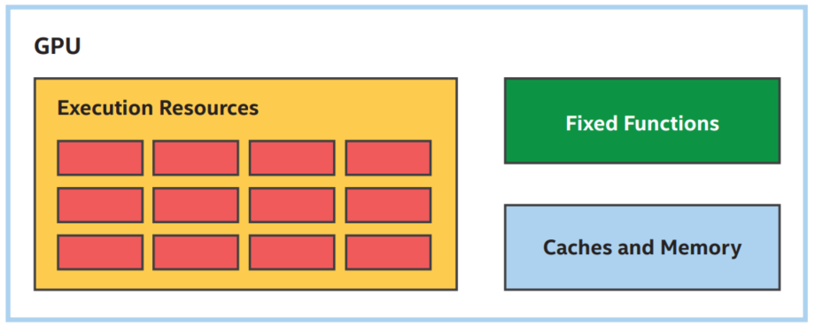

-----

| Title     | Hardware GPU                                         |
| --------- | ---------------------------------------------------- |
| Created @ | `2023-03-08T13:37:09Z`                               |
| Updated @ | `2023-03-08T13:37:09Z`                               |
| Labels    | \`\`                                                 |
| Edit @    | [here](https://github.com/junxnone/xwiki/issues/218) |

-----

# GPU

  - Execution Resources 运算资源
  - Fixed Functions 固定函数的计算单元(例如图形计算中的光线追踪)
  - Caches and Memory

