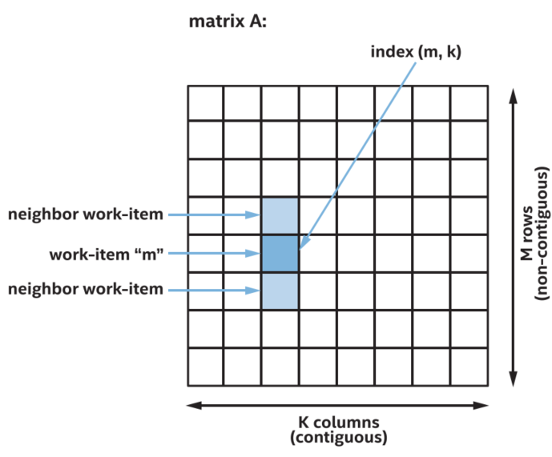
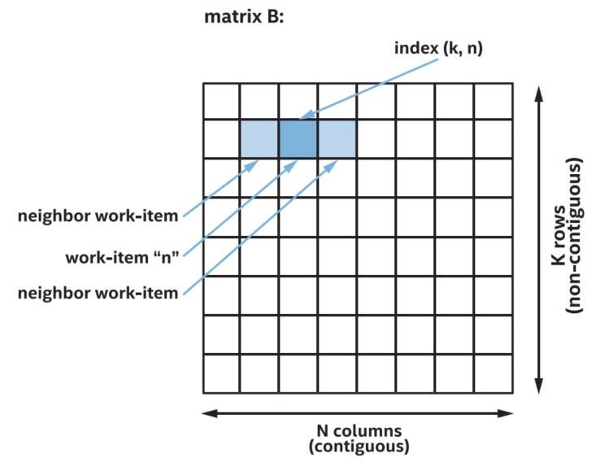

-----

| Title     | OPT GPU                                              |
| --------- | ---------------------------------------------------- |
| Created @ | `2023-03-09T07:13:10Z`                               |
| Updated @ | `2023-03-09T09:26:58Z`                               |
| Labels    | \`\`                                                 |
| Edit @    | [here](https://github.com/junxnone/xwiki/issues/220) |

-----

# GPU 性能优化

  - 通常为 Memory Bound(因为GPU有很多 processors & SIMD Widths)

## Memory bounds

  - **Global Memory**: 最小化 cache line
  - **Local Memory**: 最小化 `bank conflicts`

### Memory 的连续访问 & 间隔访问

  - `连续访问内存` 比 `间隔访问内存` 更有效

| 间隔方位内存                                                       | 连续访问内存                                                       |
| ------------------------------------------------------------ | ------------------------------------------------------------ |
|  |  |

### Work-Group Local Memory & Barriers

  - 支持更高的 bandwidth
  - 低 Latency
  - 支持同时访问多 bank(Local Memory 不同的区域) ,
  - 可能存在的 `bank conflict`

### sub-group collective functions

  - 使用 `collective functions` 可以替代 `Local Memory` 在 sub-group 中进行数据交换

## Compute Bound

  - 精度换速度
      - 使用较低精度(`FP16`)的数据类型
      - 有些 GPU 针对 `FP32` 类型数据做了优化
  - 使用 精确度低但性能高的 `Math Functions`
  - 专用指令 (mad/fma/...)
