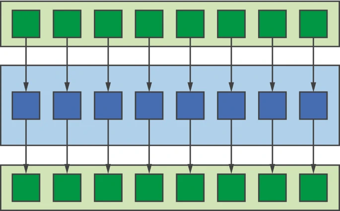
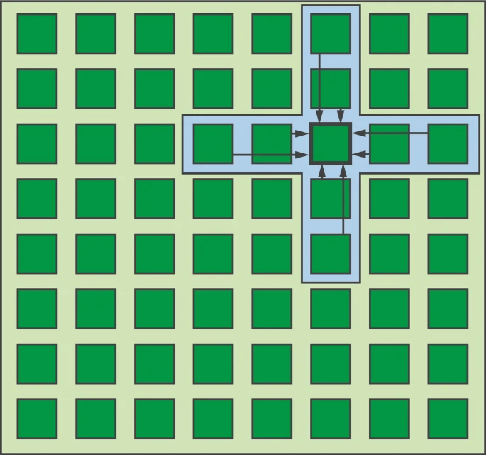
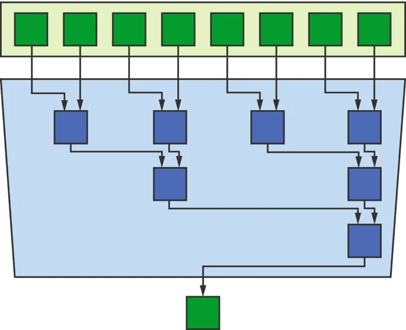
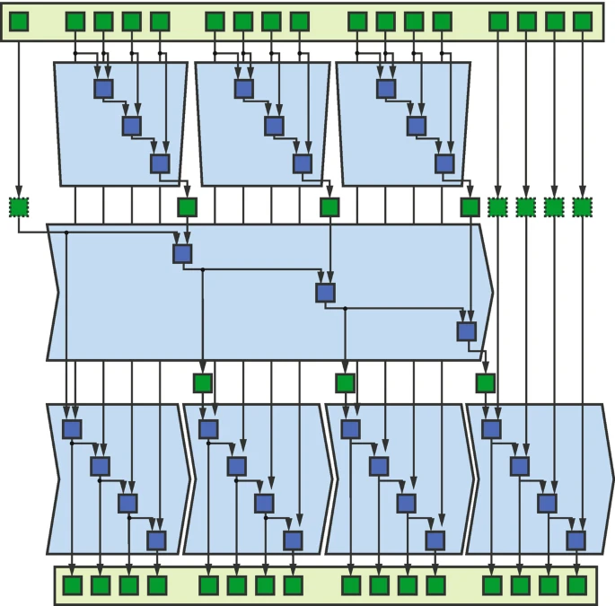
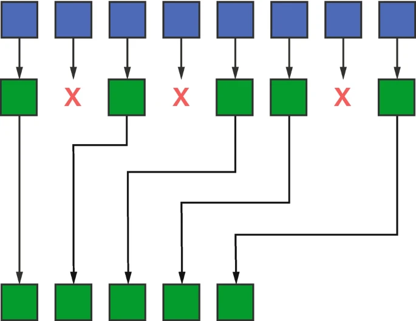
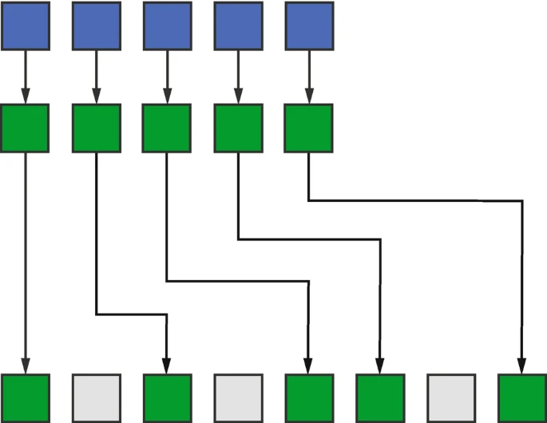

-----

| Title     | OPT PARA Patterns                                    |
| --------- | ---------------------------------------------------- |
| Created @ | `2023-03-10T08:30:25Z`                               |
| Updated @ | `2023-03-10T09:05:07Z`                               |
| Labels    | \`\`                                                 |
| Edit @    | [here](https://github.com/junxnone/xwiki/issues/221) |

-----

# Parallel Patterns

## Map

  - 简单的并行 Kernel
  - 每个输入通过某个函数映射到独立的输出

## Stencil

  - 结构化的数据
  - 输入和相邻的输入应用 `stencil` 后产生一个输出

## Reduction

  - 合并数据
  - sum/min/max

## Scan

## Pack

  - 将连续输入元素通过 `Boolean` 筛选后输出到连续位置

## Unpack

  - 和 `Pack` 相反
  - 产生不连续的输出

