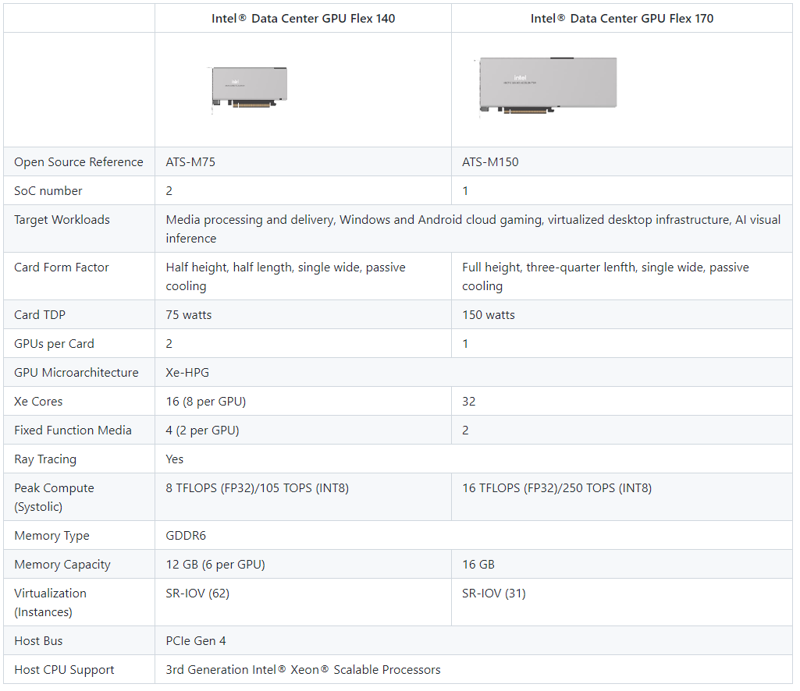
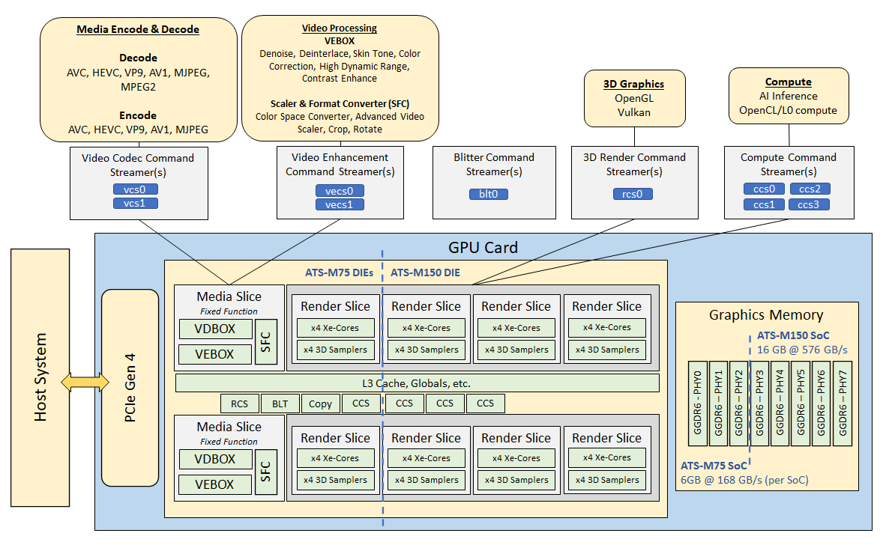

-----

| Title     | Hardware GPU iGPU dGPU                               |
| --------- | ---------------------------------------------------- |
| Created @ | `2023-03-17T08:27:43Z`                               |
| Updated @ | `2023-03-17T09:00:42Z`                               |
| Labels    | \`\`                                                 |
| Edit @    | [here](https://github.com/junxnone/xwiki/issues/223) |

-----

# Data Center GPUs

## Flex 系列

  - Flex 140 - `ATS-M75`
  - Flex 170 - `ATS-M150`

## Max 系列

| x                 | Max 1550 GPU (600W OAM) | Max 1350 GPU (450W OAM) | Max 1100 GPU (300W PCIe) |
| ----------------- | ----------------------- | ----------------------- | ------------------------ |
| Architecture      | Xe HPC                  | Xe HPC                  | Xe HPC                   |
| Xe Cores          | 128                     | 112                     | 56                       |
| Memory            | HBM2E 128 GB            | HBM2E 96 GB             | HBM2E 48 GB              |
| Cache             | L1 64 MBL2 408 MB       | L1 48 MBL2 216 MB       | L1 28 MBL2 108 MB        |
| Max TDP           | 600W                    | 450W                    | 300W                     |
| Form Factor       | OAM                     | OAM                     | PCIe AIC                 |
| Host Interconnect | PCIe Gen5               | PCIe Gen5               | PCIe Gen5                |
| Physical Ports    | Xe Link 53 GB/s16 ports | Xe Link 53 GB/s16 ports | Xe Link 53 GB/s6 ports   |

## References

  - [Intel® Data Center GPU Flex
    Series](https://github.com/intel/media-delivery/blob/master/doc/benchmarks/intel-data-center-gpu-flex-series/intel-data-center-gpu-flex-series.rst#about-intel-data-center-gpu-flex-series)
