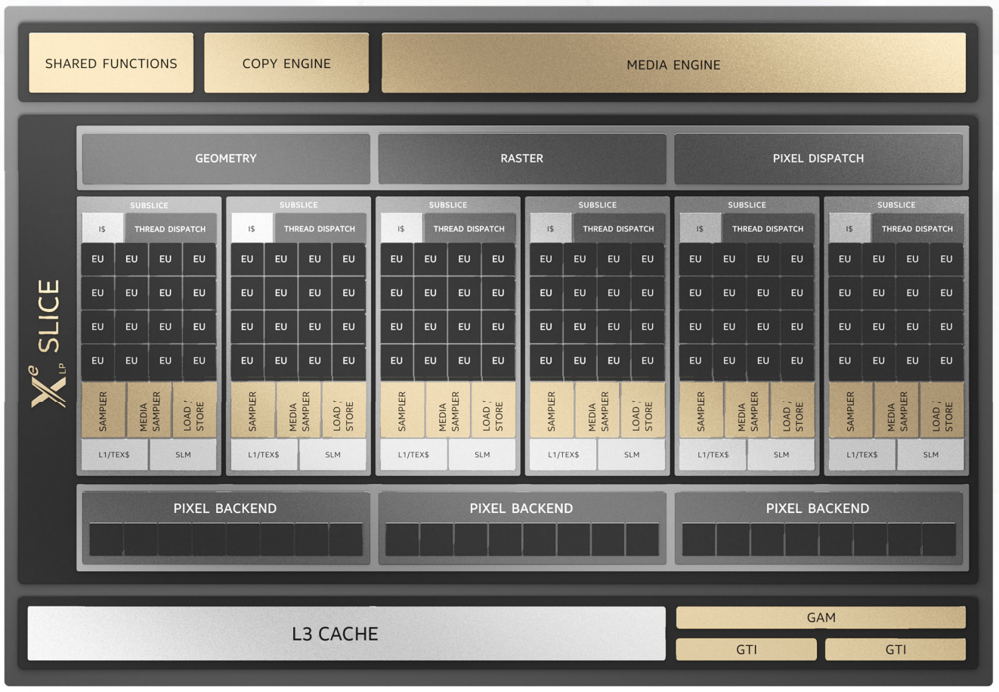
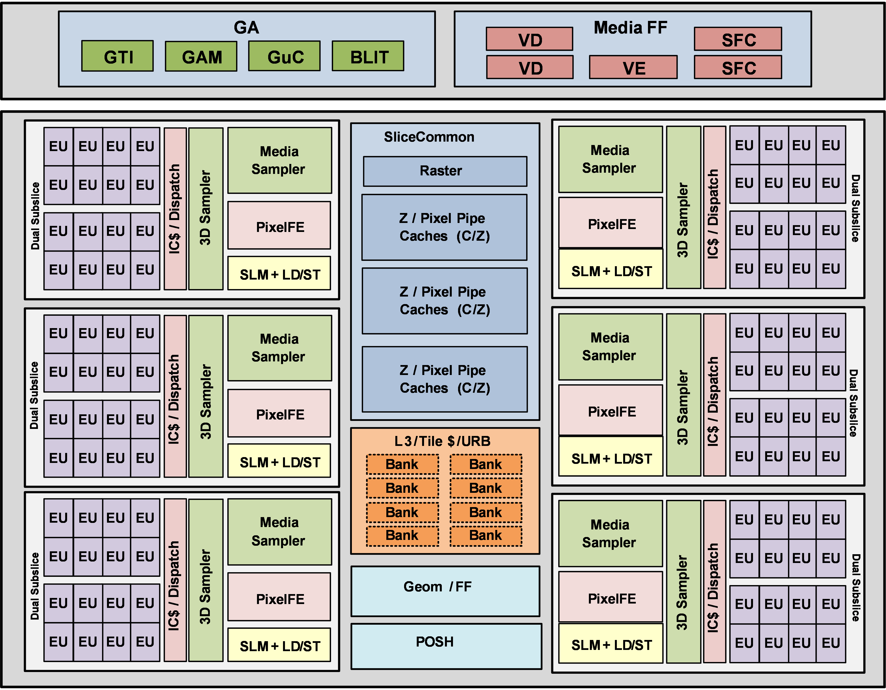
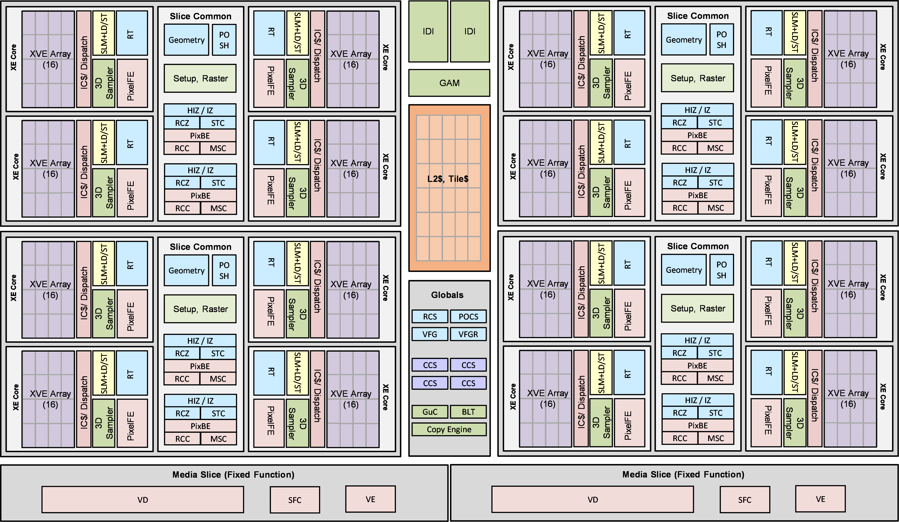
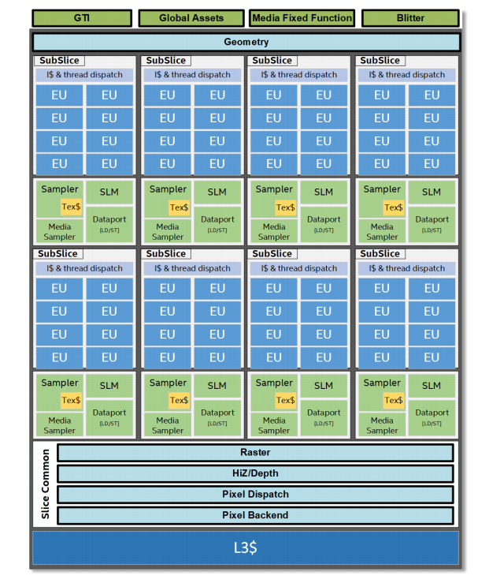
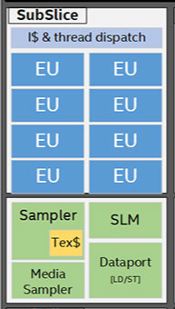
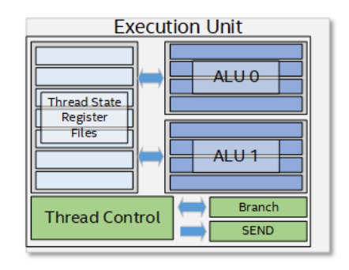
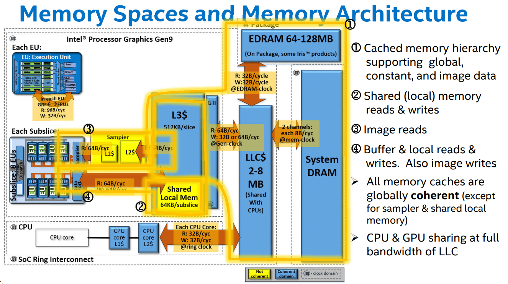
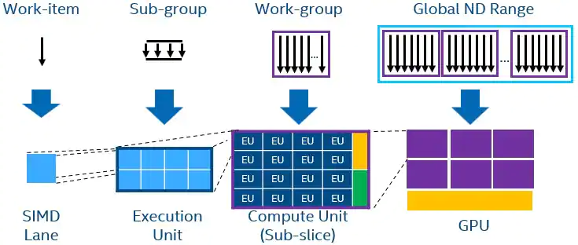
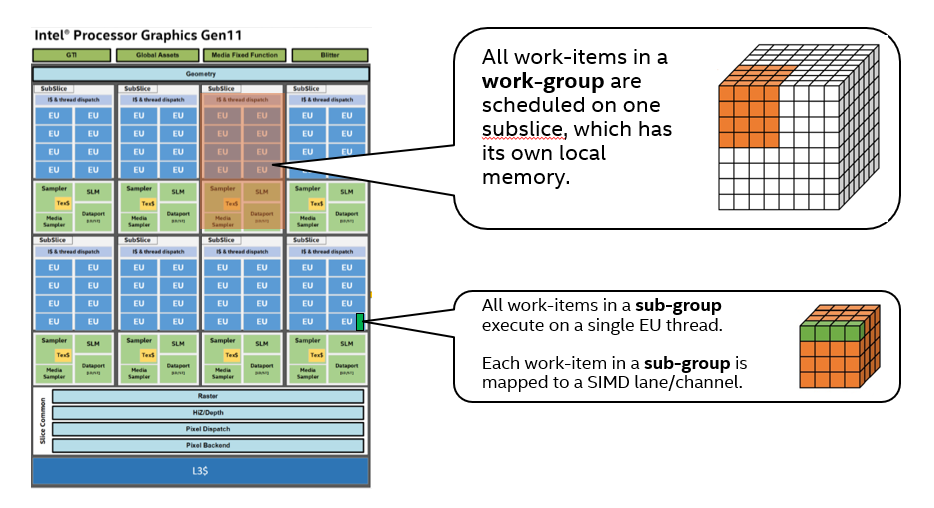

-----

| Title     | Hardware GPU iGPU Arch                               |
| --------- | ---------------------------------------------------- |
| Created @ | `2023-03-17T09:12:51Z`                               |
| Updated @ | `2023-05-25T14:16:08Z`                               |
| Labels    | \`\`                                                 |
| Edit @    | [here](https://github.com/junxnone/xwiki/issues/225) |

-----

# Intel GPUs Arch

  - Slice
  - SubSlice
  - EU
  - ALU
  - GRF - `general-purpose registers`

## 架构图

### DG1 Gen12.1 GPU

### Arc GPU Gen 12.7

### Intel GPUs Gen

| Gen      | Code Name                              | Name                                                                                           |
| -------- | -------------------------------------- | ---------------------------------------------------------------------------------------------- |
| Gen 9    | Sky Lake Kaby Lake Coffee Lake         | Intel® UHD Graphics Intel® Iris® Graphics Intel® Iris® Plus Graphics Intel® Iris® Pro Graphics |
| Gen 11   | Ice Lake                               | Intel® Iris® Plus Graphics                                                                     |
| Gen 12.1 | Rocket Lake Tiger Lake                 | Intel® Iris® Xe Graphics                                                                       |
| Gen 12.1 | DG1                                    | Intel® Iris® Xe Max Graphics                                                                   |
| Gen 12.1 | Alder Lake                             | Intel® Iris® Xe Graphics                                                                       |
| Gen 12.5 | Arctic Sound (ATS)                     | \-                                                                                             |
| Gen 12.7 | Alchemist or ACM (previously DG2)ATS-M | Intel® Xe-HPG Graphics                                                                         |
| Gen 12.7 | Ponte Vecchio (PVC)                    | Intel® Xe-HPC Graphics                                                                         |

## 架构层次

  - Tile --\> Slice --\> Sub-slice --\> EU

| Old Term                         | New Intel Term              | Generic Term  | New abbreviation |
| -------------------------------- | --------------------------- | ------------- | ---------------- |
| Execution Unit (EU)              | Xe Vector Engine            | Vector Engine | XVE              |
| Sub-slice (SS) or Dual Sub-slice | Xe-core                     | N/A           | XC               |
| Slice                            | For Xe-HPG: - Render Slice  | Slice         | SLC              |
| \--                              | For Xe-HPC: - Compute Slice | Slice         | SLC              |
| Tile                             | Stack                       | Stack         | STK              |

### Slice

### SubSlice

### EU

### ALU

  - 每个 EU 包含两个 ALU
  - 每个 ALU 可以执行 4xFP32/8xFP16
  - 每个 EU 可以执行 8xFP32
  - `Total Threads = SubSlices x EUs x Threads`
  - `Total Operations = Total Threads x SIMD Width`

### 不同的 GPUs 参数

| Generations           | Threads per EU | EUs per SubSlice | SubSlices | Total Threads | Total Operations |
| --------------------- | -------------- | ---------------- | --------- | ------------- | ---------------- |
| Gen9 (BDW)            | 7              | 8                | 3         | 168           | 1344             |
| Intel Iris Xe (Gen11) | 7              | 8                | 8         | 448           | 3584             |
| Intel Iris Xe (Gen12) | 7              | 16               | 6         | 672           | 5376             |

## Memory

  - CPU & GPU 共享物理内存(zero-copy)
  - L1 & L2 Sampler caches
  - L3 Cache(64Byte/Cycle)

## SLM

  - SLM - `Shared Local Memory`
  - 通过 Global Memory 共享数据和通信效率较低，所以 SLM 出现了
  - SLM 的设计目的: 高带宽/低延迟 work-items 之间共享数据
  - Read & Write /Cycle = 64 Byte = 16 x 4 Byte
  - DPCPP 获取 SLM Info -
    `q.get_device().get_info<sycl::info::device::local_mem_size>()`
  - **Bank Conflicts** \[[CUDA SHARED MEMORY - Bank
    Conflict](https://www.cnblogs.com/1024incn/p/4605502.html)\]
      - 依赖于 Device
      - **Bank(Cache line)** - 64 Byte = 16 Bank x 4 Byte(32-bit)
      - 同时访问一个 Bank 的不同地址会引起 `Bank conflicts`, 硬件限制会导致串行访问

### SLM 特性

  - 64KB/Subslice
  - `Instruction Cache`
  - `Local Thread Dispatcher`
  - `Read-Only Texture/Image Sampler` - 64B/Cycle
  - `Dataport` - 64B/Cycle
  - 每个 Subslice 执行的 `work-items` = `Eus x Threads x SIMD Width`
  - SLM: 是在 Subslice 所有 `work-items` 内共享 `atomic data`
      - 如果 work-group 内包含同步操作, 需要分配在同一个 Subslice
  - `work-groups` \< 16

## \[\[NDRange\]\] Mapping to iGPU

  - `work-items` 分配到 operations
  - `sub-group` 分配到 threads
  - `work-group` 受 hardware 限制 (Iris Xe 每个 subslice 最多 16个，最多 512 个
    `work-items`)

|  |  |
| ------------------------------------------------------------ | ------------------------------------------------------------ |

| Summary       | EUs     | Threads   | Operations | Maximum Work Group Size | Maximum Work Groups |
| ------------- | ------- | --------- | ---------- | ----------------------- | ------------------- |
| Each SubSlice | 16      | 7x16=112  | 112x8=896  | 512                     | 16                  |
| Total         | 16x6=96 | 112x6=672 | 896x6=5376 | 512                     | 16x6=96             |

> Intel® Iris® Xe Graphics (TGL) GPU

> `There are 16 barrier registers per sub-slice, so no more than 16
> work-groups can be executed simultaneously.` `The amount of shared
> local memory available per sub-slice (64KB). If for example a
> work-group requires 32KB of shared local memory, only 2 of those
> work-groups can run concurrently, regardless of work-group size.`

## Reference

  - [Intel® Processor Graphics Gen11
    Architecture](https://www.intel.com/content/dam/develop/external/us/en/documents/the-architecture-of-intel-processor-graphics-gen11-r1new.pdf)
