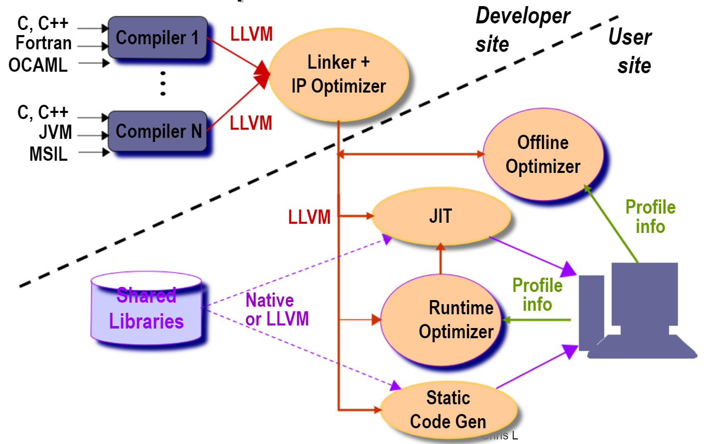

-----

| Title     | Programing Compiler LLVM                             |
| --------- | ---------------------------------------------------- |
| Created @ | `2023-03-21T15:45:51Z`                               |
| Updated @ | `2023-09-03T04:50:19Z`                               |
| Labels    | \`\`                                                 |
| Edit @    | [here](https://github.com/junxnone/xwiki/issues/227) |

-----

# LLVM

  - LLVM - `Low Level Virtual Machine`

## Modules

### 前端

#### 预编译

  - 文件包含
  - 宏展开
  - 条件编译
  - 删除注释

#### 词法分析

  - 关键字
  - 标识符
  - 运算符
  - 分解符
  - 常数

#### 语法分析

  - 标识符是表达式
  - 常数是表达式
  - 表达式 1 和 表达式 2 都是表达式

#### 语义分析

  - 完成静态语义审查和处理
  - 上下文相关性审查
  - 类型匹配审查
  - 类型转换

### 中端

  - LLVM 中间表示
  - LLVM 虚拟指令集
  - 中间代码优化 (`-O1/-O2/-O3/-Ofast`)
  - 死代码删除
  - 过程间优化(内联优化/...)
  - 自动向量优化
      - 循环级向量化
      - 基本快向量化
  - 循环优化
      - 循环展开
      - 循环分布
      - 循环剥离
  - 浮点优化
      - 浮点数据规约向量化
      - 除法运算优化
      - 忽略浮点数 0 正负号
  - 数据预取优化(自动/手动)

### 后端

## Reference

  - [官网](https://llvm.org/)
