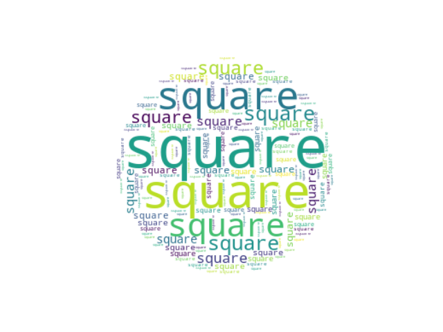
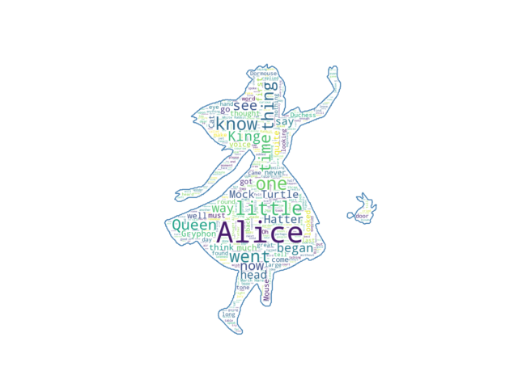

-----

| Title     | X WordCloud                                          |
| --------- | ---------------------------------------------------- |
| Created @ | `2020-03-01T14:18:58Z`                               |
| Updated @ | `2023-03-27T14:26:18Z`                               |
| Labels    | \`\`                                                 |
| Edit @    | [here](https://github.com/junxnone/xwiki/issues/233) |

-----

# Word Cloud - 词云生成

  - 数据分析工具
  - Excel 插件
  - 在线网站工具
  - 编程 python/...

**Style**

|  |  |  |
| ------------------------------------------------------------ | ------------------------------------------------------------ | ------------------------------------------------------------ |

## Reference

  - Python
      - [word\_cloud ](https://github.com/amueller/word_cloud)
        \[[Docs](https://amueller.github.io/word_cloud/)\]
  - Online
      - [d3-cloud](https://github.com/jasondavies/d3-cloud)
      - [wordcloud2.js](https://github.com/timdream/wordcloud2.js)
      - [https://github.com/timdream/wordcloud](https://wordcloud.timdream.org/)
      - [VueWordCloud](https://seregpie.github.io/VueWordCloud/)
      - [wordart](https://wordart.com/create)
      - [wordclouds](https://www.wordclouds.com/)
