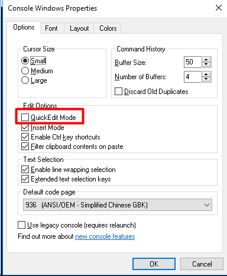

-----

| Title     | Windows Issues CommandLineHang                       |
| --------- | ---------------------------------------------------- |
| Created @ | `2021-08-24T02:20:03Z`                               |
| Updated @ | `2023-03-27T14:45:08Z`                               |
| Labels    | \`\`                                                 |
| Edit @    | [here](https://github.com/junxnone/xwiki/issues/234) |

-----

# Windows 命令行执行命令时卡住

  - 命令行执行命令时卡住，需要敲下回车才能继续显示log，否则就卡住了
  - 当鼠标点击cmd任何区域时，就自动进入了编辑模式，有时会等待输入挂起
  - 在控制台里面回车或者右键鼠标后，自动退出了编辑模式

## Solution

  - **关闭 `快速编辑模式`**
  - `标题栏右键` -\> `Properties` -\> `Edit Option` -\> `QuickEdit Mode`
  - `标题栏右键` -\> `Defaults` -\> `Edit Option` -\> `QuickEdit Mode`

-----

## Reference

  - [cmd执行程序时容易卡住以及解决方式](https://www.cnblogs.com/stonemjl/p/13530774.html)
