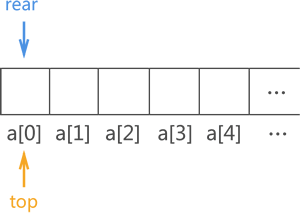
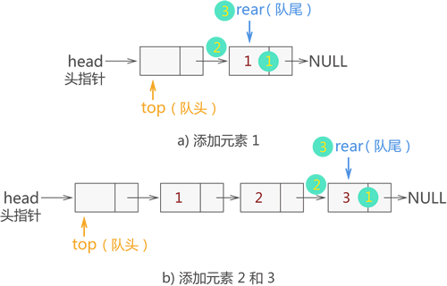

-----

| Title     | Programing DS                                        |
| --------- | ---------------------------------------------------- |
| Created @ | `2023-04-02T16:12:23Z`                               |
| Updated @ | `2023-04-18T14:11:38Z`                               |
| Labels    | \`\`                                                 |
| Edit @    | [here](https://github.com/junxnone/xwiki/issues/237) |

-----

# 数据结构

  - Data Structure
  - 数据的存储方式

## 包含的内容

### 顺序表

### 链表

#### 单链表

#### 双链表

#### 循环链表

### 栈

#### 顺序栈

#### 链栈

### 队列

#### 顺序队列

#### 链队列

### 树

### 图

## Reference

  - [数据结构简介](https://oi-wiki.org/ds/)
  - [数据结构与算法教程](http://c.biancheng.net/data_structure/)
  - [数据结构基础知识体系详解](https://pdai.tech/md/algorithm/alg-basic-overview.html)
  - [数据结构与算法](https://www.runoob.com/data-structures/data-structures-tutorial.html)
