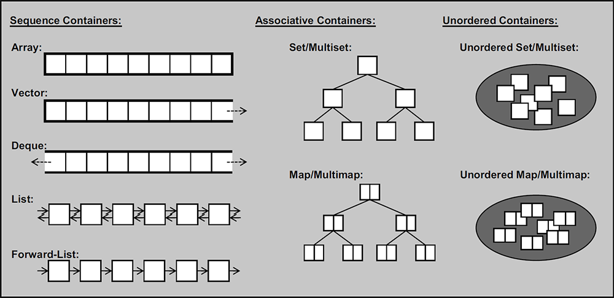

-----

| Title     | Programing CPP STD STL Container                     |
| --------- | ---------------------------------------------------- |
| Created @ | `2023-04-18T14:09:25Z`                               |
| Updated @ | `2023-06-04T04:25:15Z`                               |
| Labels    | \`\`                                                 |
| Edit @    | [here](https://github.com/junxnone/xwiki/issues/241) |

-----

# STL 容器

## 序列式容器

### 向量 Vector

### 数组 Array

### 双端队列 Deque

### 列表 List

### 单向列表 forward\_list

## 关联式容器

### 集合 set

### 多重集合 multiset

### 映射 map

### 多重映射 multimap

## 无序容器

### 无序（多重）集合 unordered\_set/multiset

### 无序（多重）映射 unordered\_map/multimap

## 容器适配器

### 栈 stack

### 队列 queue

### 优先队列 priority\_queue

## Reference

  - [STL 容器简介](https://oi-wiki.org/lang/csl/container/)
