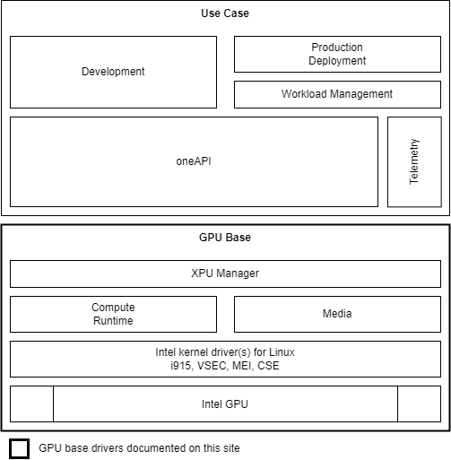
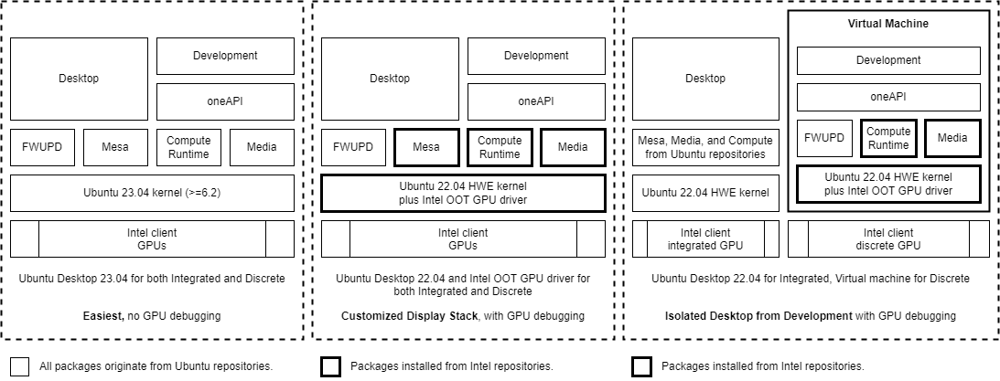

-----

| Title     | Hardware GPU iGPU Drivers                            |
| --------- | ---------------------------------------------------- |
| Created @ | `2023-05-25T13:11:35Z`                               |
| Updated @ | `2023-05-25T13:11:35Z`                               |
| Labels    | \`\`                                                 |
| Edit @    | [here](https://github.com/junxnone/xwiki/issues/244) |

-----

# iGPU Drivers

  - [Compute Runtime](https://github.com/intel/compute-runtime)
  - [Media Driver](https://github.com/intel/media-driver)
  - [Media SDK](https://github.com/Intel-Media-SDK/MediaSDK) (no longer
    under development)
  - [Intel Graphics
    Compiler](https://github.com/intel/intel-graphics-compiler)
  - [Mesa](https://github.com/intel-gpu/Mesa)
  - [opencl\_clang](https://github.com/intel/opencl-clang)
  - [vc-intrinsics](https://github.com/intel/vc-intrinsics)
  - [intel-onevpl](https://github.com/oneapi-src/oneVPL-intel-gpu)
  - [vpl\_dispatcher](https://github.com/oneapi-src/oneVPL)
  - [cm\_clang](https://github.com/intel/cm-compiler)
  - [gmmlib](https://github.com/intel/gmmlib/)
  - [Level Zero](https://github.com/oneapi-src/level-zero/)
  - [libva](https://github.com/intel/libva/)
  - [ME TEE Library](https://github.com/intel/metee/)
  - [Metrics Discovery](https://github.com/intel/metrics-discovery/)

## Arch

## Reference

  - 
