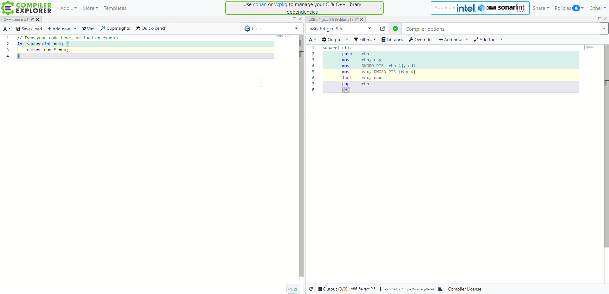

-----

| Title     | Tools CompilerExplorer                               |
| --------- | ---------------------------------------------------- |
| Created @ | `2023-06-05T16:19:02Z`                               |
| Updated @ | `2023-06-05T16:19:02Z`                               |
| Labels    | \`\`                                                 |
| Edit @    | [here](https://github.com/junxnone/xwiki/issues/253) |

-----

# Compiler Explorer

  - 查看各种编译器的编译结果

## Support Language

[Support
Language](https://godbolt.org/api/languages ":include :type=iframe width=100% height=600px")

## Reference

  - [Compiler Explorer](https://godbolt.org/)
    \[[Code](https://github.com/compiler-explorer/compiler-explorer)\]
