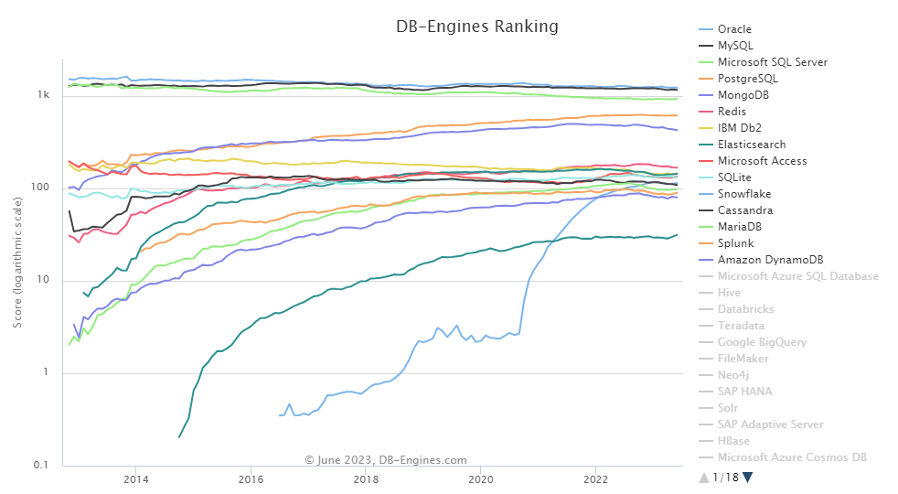
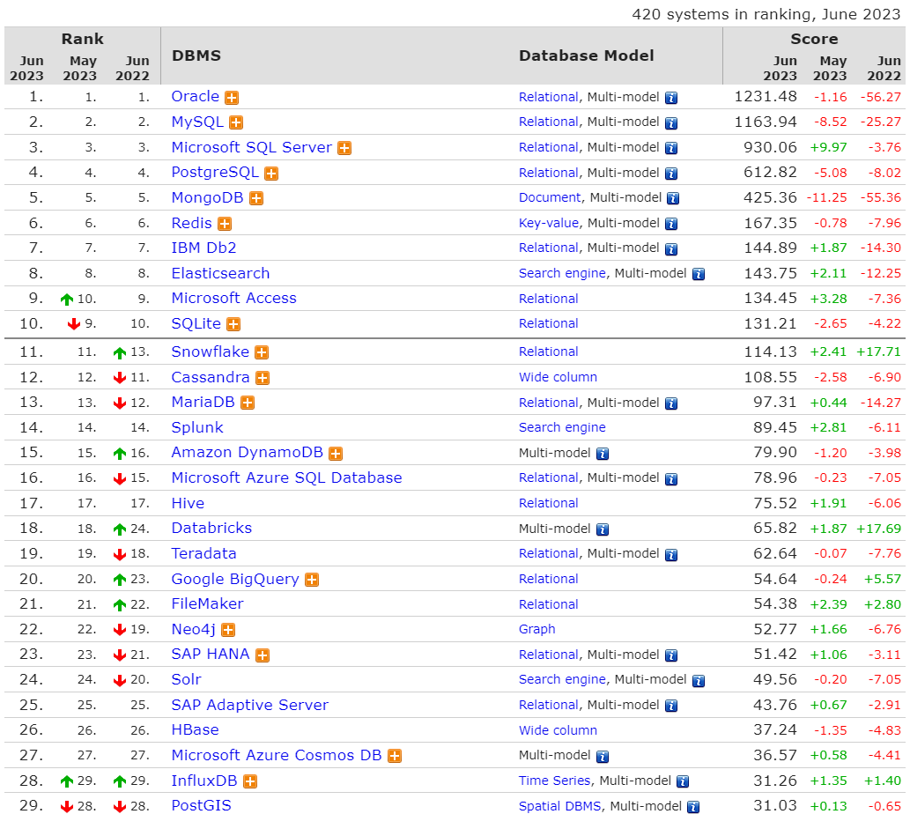

-----

| Title     | Programing database                                  |
| --------- | ---------------------------------------------------- |
| Created @ | `2023-06-13T15:08:43Z`                               |
| Updated @ | `2023-06-13T15:08:43Z`                               |
| Labels    | \`\`                                                 |
| Edit @    | [here](https://github.com/junxnone/xwiki/issues/254) |

-----

# 数据库 Database

  - 数据库分类
      - Relational DBMS
      - Key-value stores
      - Document stores
      - Time Series DBMS
      - Graph DBMS
      - Search engines
      - Object oriented DBMS
      - RDF stores
      - Wide column stores
      - Multivalue DBMS
      - Vector DBMS
      - Native XML DBMS
      - Spatial DBMS
      - Event Stores
      - Content stores
      - Navigational DBMS

## 数据库排名

  - [DB-engines Ranking](https://db-engines.com/en/ranking)
  - [DB-engines Trend](https://db-engines.com/en/ranking_trend)

## Reference

  - [DB-engines Encyclopedia](https://db-engines.com/en/articles)
