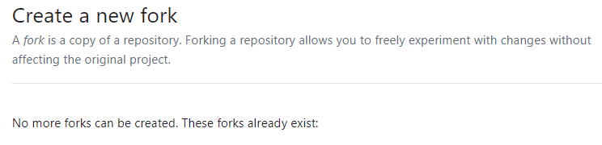

-----

| Title     | Tools Github forkfork                                |
| --------- | ---------------------------------------------------- |
| Created @ | `2023-06-19T14:44:13Z`                               |
| Updated @ | `2023-06-19T14:44:13Z`                               |
| Labels    | \`\`                                                 |
| Edit @    | [here](https://github.com/junxnone/xwiki/issues/267) |

-----

# Github fork other fork

  - 1 你 fork 了原始 repo
  - 2 别人也 fork 了 原始 repo
  - 3 别人提交了一个 commit
  - 4 你想 fork 他的 fork 时，不能 fork, 出现如下错误

## Solution

### git clone 到本地, 添加到repo 中为不同的remote，创建新的branch, 然后 push

    $ git remote add their_user_name git@github.com:their_user_name /repo_name.git
    $ git fetch their_user_name
    $ git checkout -b new_branch their_user_name/their_branch
    $ git push origin new_branch
