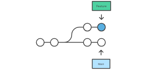
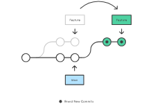

-----

| Title     | Tools Git Rebase                                     |
| --------- | ---------------------------------------------------- |
| Created @ | `2023-06-26T01:34:29Z`                               |
| Updated @ | `2023-06-26T01:34:29Z`                               |
| Labels    | \`\`                                                 |
| Edit @    | [here](https://github.com/junxnone/xwiki/issues/274) |

-----

# Git Rebase

  - pick 改变 commit 顺序 /删除中间 commit
  - reword - `r` - 更改 comment
  - 合并本地的多条 commit 到一个 commit
  - 
## pick

``` 

```

## 图解

| Rebase 前                                                     | Rebase 后                                                     |
| ------------------------------------------------------------ | ------------------------------------------------------------ |
|  |  |
