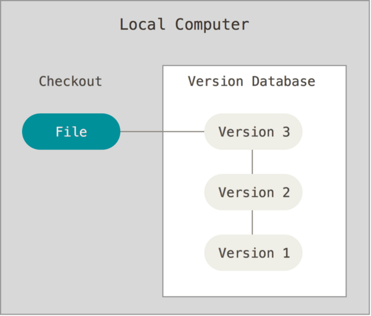
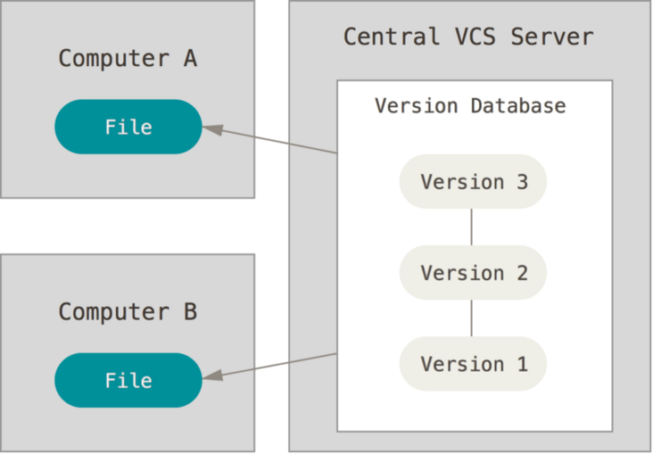
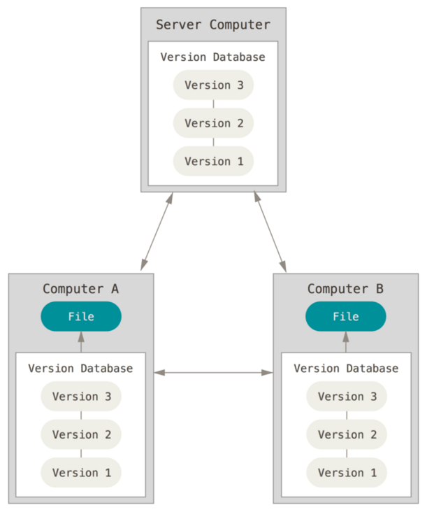

-----

| Title     | X VCS                                                |
| --------- | ---------------------------------------------------- |
| Created @ | `2023-06-30T14:38:51Z`                               |
| Updated @ | `2023-06-30T14:38:51Z`                               |
| Labels    | \`\`                                                 |
| Edit @    | [here](https://github.com/junxnone/xwiki/issues/275) |

-----

# VCS 版本控制系统

  - VCS - `Version Control Systems`
  - RCS - `Revision Control System`
  - CVCS - `Centralized Version Control Systems`
      - CVS
      - Subversion
      - Perforce
  - DVCS - `Distributed Version Control System`
      - Git
      - Mercurial
      - Bazaar
      - Darcs
      - BitKeeper

## 分类

  - 本地版本控制系统
  - 集中化的版本控制系统 - CVCS
  - 分布式的版本控制系统 - DVCS

| LVCS?                                                        | CVCS                                                         | DVCS                                                         |
| ------------------------------------------------------------ | ------------------------------------------------------------ | ------------------------------------------------------------ |
|  |  |  |

## History

## Reference

  - [3分钟带你了解版本控制系统的发展历史](https://segmentfault.com/a/1190000040421438)
