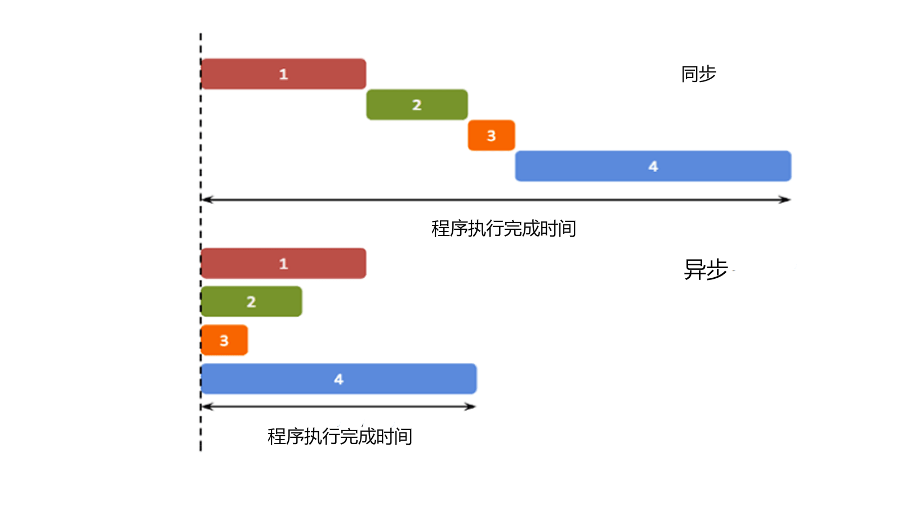

-----

| Title     | Programing js                                        |
| --------- | ---------------------------------------------------- |
| Created @ | `2023-07-04T03:27:49Z`                               |
| Updated @ | `2023-07-09T14:11:38Z`                               |
| Labels    | \`\`                                                 |
| Edit @    | [here](https://github.com/junxnone/xwiki/issues/276) |

-----

# JavaScript

  - 用于 HTML & WEB 开发网页应用？
  - js 也可以做 ML

## 数据类型

  - 值类型(基本类型)
      - Boolean(`true`/`false`)
      - Number
      - String
      - Null 用于对象(设置为 `null`, 清空变量)
      - Undefined 用于变量 (对象不含值)
      - Symbol
  - 引用数据类型(对象类型)
      - Array
      - Object
      - Function
      - Date
      - Regex
      - ......
  - 查看数据类型 - `typeof(your_var)`
  - Number - `34`/`34.0`/`34e-5`

## 变量定义

  - 字母开头
  - 大小写敏感
  - 动态数据类型
  - var
      - 不具备块级作用域的特性，一下块中声明的仍为全局变量
          - { } 中
          - 循环中
      - 函数中的声明为局部变量
  - let 局部变量
      - 使用 let 声明的全局变量不属于 window 对象
      - 不可以使用后声明
      - 块级作用域
  - 全局变量
  - const 只读变量
      - 声明时必须初始化
      - 初始化后值不可修改
      - 块级作用域
      - 定义的对象或数组，内容是可变的，不可对对象进行赋值
  - 变量作用域(生存期)

## 运算符

  - `+-*/=`
  - `==` `!=` `<` `>`

## 注释

  - `//`
  - `/*` ... `*/`

## 控制语句

  - if...else
  - for...in
  - do...while
  - break
  - continue
  - switch
  - try...catch
  - while

## 事件 event

  - 鼠标事件
  - 键盘事件
  - 对象事件
  - 表单事件
  - 剪贴板事件
  - 打印事件
  - 拖动事件
  - 多媒体事件
  - 动画事件
  - 过渡事件
  - 其他事件
  - 常用事件
      - onclick
      - onchange
      - onmouseover
      - onmouseout
      - onkeydown
      - onload
      - ......

## 错误

  - try - 测试代码块
  - throw - 创建自定义错误
  - catch - 处理错误
  - finally - 在 try 和 catch 语句之后, 无论是否有触发异常，该语句都会执行

## Debug

  - 浏览器 <kbd>F12</kbd>
  - `VS Code` + `Live Server`

## 异步同步

  - 同步 - 按顺序执行
  - 异步 - 不保证顺序执行
      - 通过回调函数来处理异步任务结果
  - Promise(...).then(...).then(...)
      - then()
      - catch()
      - finally()
        
