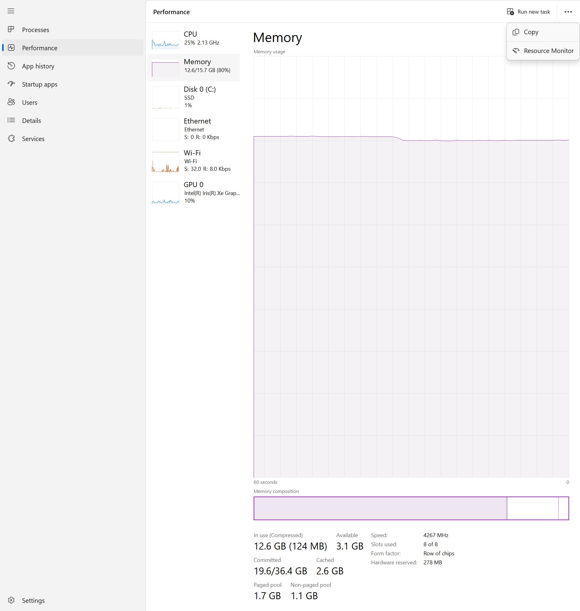
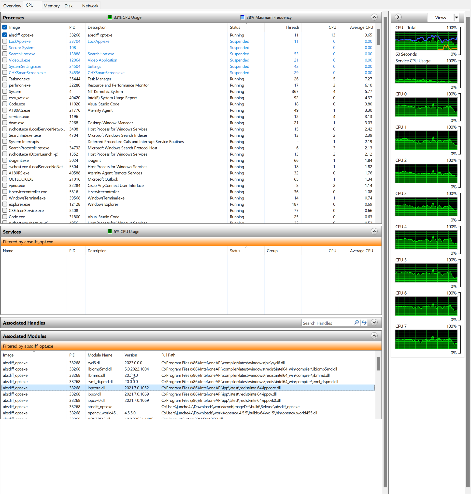

-----

| Title     | Windows CallLib                                      |
| --------- | ---------------------------------------------------- |
| Created @ | `2023-07-12T07:32:48Z`                               |
| Updated @ | `2023-07-12T07:32:48Z`                               |
| Labels    | \`\`                                                 |
| Edit @    | [here](https://github.com/junxnone/xwiki/issues/279) |

-----

# Windows 查看调用的Lib

  - `Task Manager` --\> `Performance` --\> `Resource Monitor` --\> `勾选
    Process` --\> `Associated Modules`

| Task Manager                                                 | Resource Monitor                                             |
| ------------------------------------------------------------ | ------------------------------------------------------------ |
|  |  |
