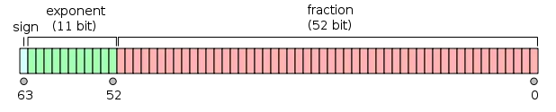
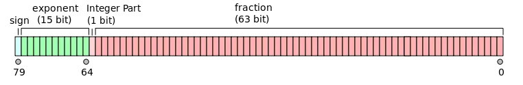

-----

| Title     | Hardware Precision                                   |
| --------- | ---------------------------------------------------- |
| Created @ | `2023-07-14T08:35:15Z`                               |
| Updated @ | `2023-07-14T08:35:15Z`                               |
| Labels    | \`\`                                                 |
| Edit @    | [here](https://github.com/junxnone/xwiki/issues/281) |

-----

# Precision

  - FP32
  - FP16
  - BF16
  - FP64
  - FP80

## FP32

  - `float`
  - `tf.float32`
  - `torch.float32`/`torch.float`

## FP16

  - `short float`
  - `tf.float16`
  - `torch.float16` / `torch.half`

## BF16

  - `tf.bfloat16`
  - `torch.bfloat16`

### bf16 vs fp16 vs fp32

## FP64

  - `double`
  - `tf.float64`
  - `torch.float64` / `torch.double`

## FP80

  - `long double`

