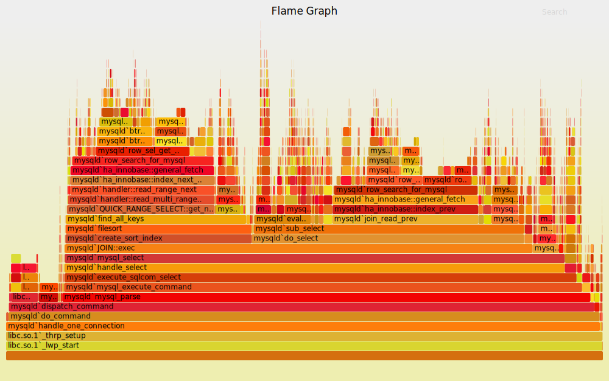

-----

| Title     | Doc FlameGraph                                       |
| --------- | ---------------------------------------------------- |
| Created @ | `2023-07-25T09:50:27Z`                               |
| Updated @ | `2023-07-25T09:50:27Z`                               |
| Labels    | \`\`                                                 |
| Edit @    | [here](https://github.com/junxnone/xwiki/issues/285) |

-----

# FlameGraph

  - 2011 \~
  - CPU Flame Graphs
  - Memory Leak Flame Graphs
  - Hot/Cold Flame Graphs
  - Differential Flame Graphs

## Reference

  - [Flame Graphs](https://www.brendangregg.com/flamegraphs.html)
    [convert svg tools](https://github.com/brendangregg/FlameGraph)
  - [d3-flame-graph - D3.js
    plugin](https://github.com/spiermar/d3-flame-graph)
  - [burn - convert performance profiles to hierarchical data
    structure](https://github.com/spiermar/burn)
